---
title: "HIV tutorial with ScipionTomo"
author: [Scipion Team]
date: "2024-10-13"
subject: "Markdown"
keywords: [Markdown, Example]
subtitle: "From movies to averages"
lang: "en"

titlepage: true
titlepage-text-color: "7137C8"
titlepage-rule-color: "7137C8"
titlepage-rule-height: 2
titlepage-logo: "logo.pdf"
logo-width: 30mm
toc: true
toc-own-page: true
...

# The dataset

The used data for this tutorial can be found the next link:

[http://scipion.cnb.csic.es/downloads/scipion/data/tutorials/tomography/](http://scipion.cnb.csic.es/downloads/scipion/data/tutorials/tomography/)

The link contains a small subsets of 5 tilt series from the EMPIAR entry [EMPIAR-10164](https://www.ebi.ac.uk/empiar/EMPIAR-10164), see the reference [B. Turonova et.al 2020](https://doi.org/10.1126/science.abd5223)

# Import tilt series movies

**Reference**: [J. Jimenez de la Morena et.at. 2022](https://doi.org/10.1016/j.jsb.2022.107872)

**Plugin**: [scipion-em-tomo](https://github.com/scipion-em/scipion-em-tomo)

The first step is to introduce the acquired data from the microscope into the Scipion framework. The protocol `tomo - import tilt series movies` allows to import different kinds of raw data. In this tutorial the raw data is a set of mcr files with the acquisition .doc files. 

> **Note**: It is mandatory that the mdoc files will be located in the same folder of the mrc files.

The mdoc files contain all acquisition information. The protocol will read all necesary information from the mdoc files such as: Sampling rate, dose per frame, tilt axis angle, among others. The form is flexible enough to correct possible errors in the mdoc file. If the protocol parameters: Microscope voltage, spherical aberration, amplitude contrast, magnification, pixel size, tilt axis angle or dose are empty, these parameters will be read from the mdoc. However, if any of these parameters is provided, the introduced value will be used.

In the figure of the form, the used parameter for the import are shown. The critical ones are:
- **Files directory:** Set the path of your movies. Note that the mdoc files must be in the same folder.
- **pattern:** In thus tutorial we import with mdoc. Set as `*.mdoc` to import all mdoc files.
- **Tomo5 mdoc:** Set as No. 
- **Microscope Voltage:** 300kV
- **Spherical Aberration:** 2.7 mm
- **Amplitude contrast:**  0.1
- **Pixel size:** 0.675  A/px. Byt setting this parameter the pixelsize from the mdoc will be overwritten.
  

# Movie alignment

**Reference**: [X. Li et. al. 2013](https://doi.org/10.1038/nmeth.2472), [S. Q Zhenget et.al. 2017](https://doi.org/10.1038/nmeth.4193)

**Plugin**: [scipion-em-motioncorr](https://github.com/scipion-em/scipion-em-motioncorr)

Once the acquired data is imported in ScipionTomo, the tilt series movies must be aligned to obtain a set of tilt series. For each tilt image, the protocol `motioncor - ts movie alignment` will find and correct the relative movement between the frames. 

For the execution of this protocol no modifications are made to the default parameters, aligning all the frames that conform each “tilt stack” of movies and without binning the output images. Only it will be necessary to input the set of tilt series movies previously imported.

> **Note**: The input tilt series movies of this dataset where acquired in superresolution mode. For this reason a binning 2 was introduced.

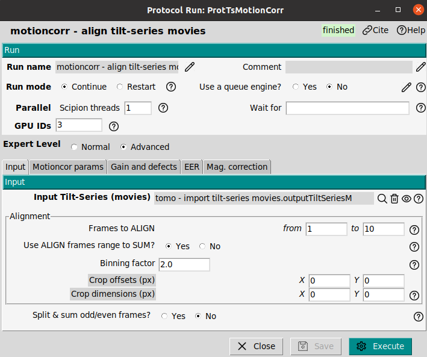

The most important parameters are:
- **Input Tilt-Series (movies):** The imported set of tilt series movies from the previous step.
- **Frames to Align:** This is the range of frames per tilt image to be aligned. If the parameter `to` is empty, then all frames will be aligned
- **Use align frames range to sum:** Yes. 
- **Binning factor:** 2
- **Split & sum odd/even frames:** No

# X-ray eraser

**Reference**: [J.R. Kremer 1996](https://doi.org/10.1006/jsbi.1996.0013)

**Plugin**: [scipion-em-imod](https://github.com/scipion-em/scipion-em-imod)

The interaction of electrons with the sample can result in an X-ray generation that can be detected by the camera. It results in very bright pixels in the images, therefore x-ray peaks are an undesired effect to be corrected. The protocol `imod - Xray eraser` allows to remove these bright points. The input will be the movie aligned tilt series. It can be executed with default parameters.

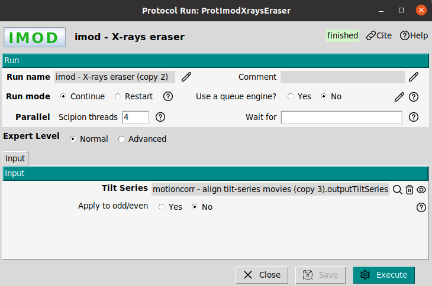

# Dose filter

**Reference**: [J.R. Kremer 1996](https://doi.org/10.1006/jsbi.1996.0013)

**Plugin**: [scipion-em-imod](https://github.com/scipion-em/scipion-em-imod)

Once the Tilt Series are free of X-rays peaks, the effect of the radiation damage is taken into account. During the image acquisition the sample is exposed to the radiation. Each tilt image present a different associated accumulated dose. The protocol `imod - dose filter` applies a low pass filterbased on the applied dose per tilt image. The result will be another set of tilt series, but in this case with a dose correction that makes the images look like a low pass filtered version of the original ones (with a soft graining).

The protocol can be executed with the default parameters.

> **Tip**: The dose filter helps in the tilt series alignment step.

> **Warning**: The output tilt series present a zero dose values, this is due to the tilt series have been filtered by accumulated dose. If the dose filtered tilt series are alter aligned and, then it will be neccesary to associate the alignment to the unfiltered tilt series (using `tomo - assign alignment`). Otherwise the subtomogram averaging that make use of the dose will work in a suboptimal manner.

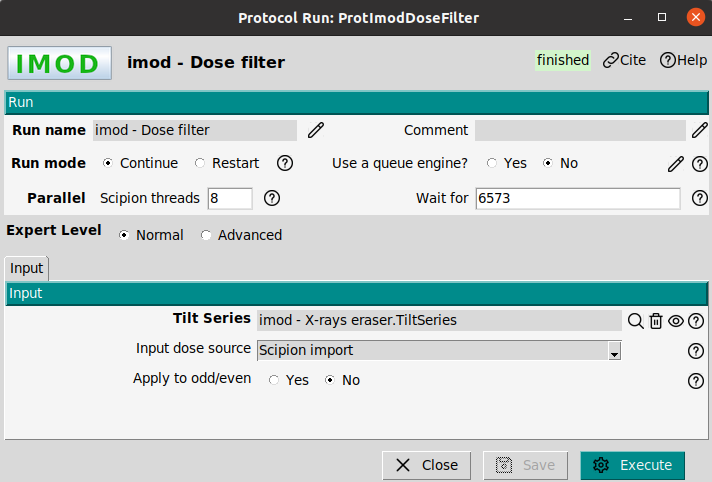

# Tilt series alignment

There are many methods to align tilt series in the ScipionTomo framework, as they are:

 - IMOD
 - Aretomo
 - EmanTomo

In this tutorial IMOD will be used, however, the user it is absolutely possible to do this tutorial with any other of the list.

## IMOD alignment

**Reference**: [J.R. Kremer 1996](https://doi.org/10.1006/jsbi.1996.0013)

**Plugin**: [scipion-em-imod](https://github.com/scipion-em/scipion-em-imod)

The imod alignment is composed by three independent protocols in the next order:

- `imod - Coarse alignment`: 
- `imod - generate fiducial model`: 
- `imod - fiducial alignment`: 

### IMOD - Coarse Alignment

The first step of the IMOD alignment is the protocol `imod - coarse prealignment`. In this step only the translational alignment (shifts) is solved (no angle correction). This calculation is performed by cross correlating the successive images from the tilt-series and stretching the images with the larger tilt angle perpendicular to the tilt axis (cosine stretching). 

The protocol can be executed with default parameters:

- **Input tilt series**: The dose filtered tilt series.
- **Use cummulative correlation**: No. 
- **Generate interpolated tilt series**: Yes at bin 4
- **Tilt axis angle**: Leave it empty. It takes the axis orientation from the scipion database.

> **Warning**: This protocol is quite sensitive to the tilt axis orientation. A wrong tilt axis orientation can be the suspicious of casting unusual results. If a wrong tilt axis orientation was imported, the tilt axis can be fixed in the tilt axis form of this protocol.

> **Note**: The output of this protocol is a set of tilt series. In the summary the output tilt series present a `+ali` flag. This flag informs that the tilt series present a transformation matrix (in this case with the estimated shifts). **The +ali indicates that matrix is associated as metadata but not applied to the tilt series**. To visualize the algined tilt series the flag of the protocol `generate interpolated tilt-series` must be enable. In the summary the interpolated tilt series can be identified with the flag `!interp`.

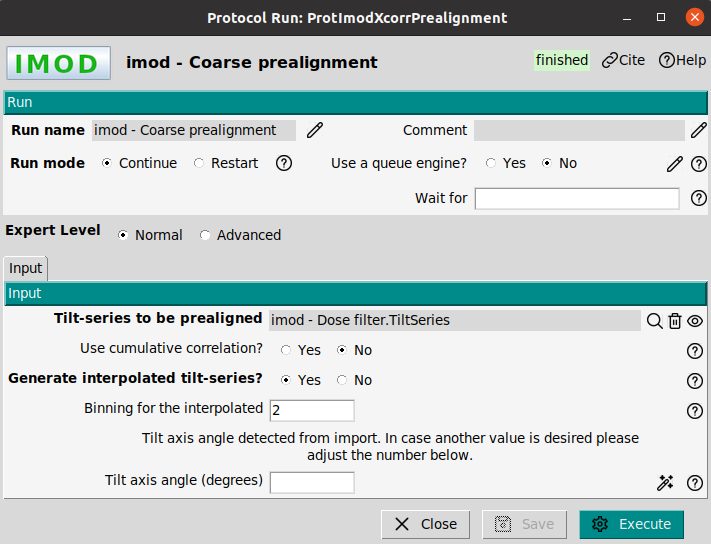

### IMOD - generate fiducial model

Once the prealignment process is finished, it is possible to generate the landmark (fiducial) models associated to the tilt series. The protocol `imod - generate fiducial model` can work with fidual and fiducialess samples. The objective of the protocol is to define a chains of landmarks to in a later step align the tilt series. 

The landmark (fiducial) model generation consists of a model that provides information of the position of each gold bead in the image. Specifically, it defines the 2D coordinates of one fiducial along all the images in which it has been detected (not necessarily the whole tilt-series). Thus, it is possible to track the position of several landmarks along the whole tilt series, making it possible to posteriorly align them, correcting its tilt axis position. If the sample is fiducialless, then the landmarks will be centers of some patches defined in the tilt images.

We will use as input of this algorithm the previous non-interpolated Tilt Series from coarse prealignment with the next parameters:

- **Model generation**: Make seed and Track. This is the fiducial based alignment
- **Tilt series**: The output of the imod - coarse prealignment
- **Fiducial diameter (nm)**: 10 nm
- **Find on two surfaces**: Yes
- **Track with fiducial model as seed**: Yes

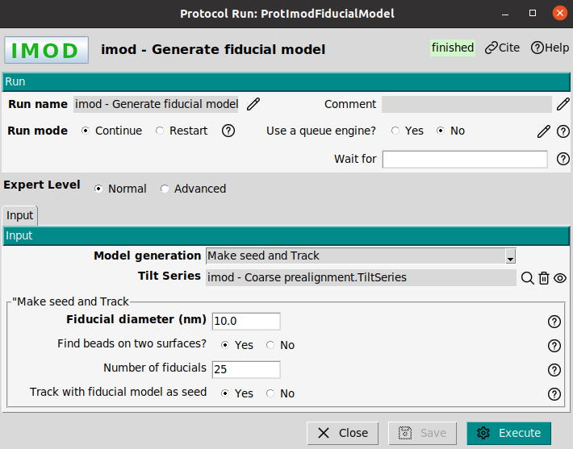

> **Tip**: In samples with gold beads (fiducials), it is important to properly set the fiducial radius (in nanometers) since, if the indicated size is significantly different from the real one, the algorithm will fail in the fiducial location and posterior tracking. Also, it is possible to set the algorithm to differentiate between those gold beads that are in front (or over) the sample and the ones that are in the rear part (or under it), using the *Find on two surfaces option*. 

The output of this protocol is a `SetOfLandmarkModels`. This object is able to store the position information of each gold bead through the tilt-series for every tilt series belonging to the set. It is possible to visualize this object with the imod viewer

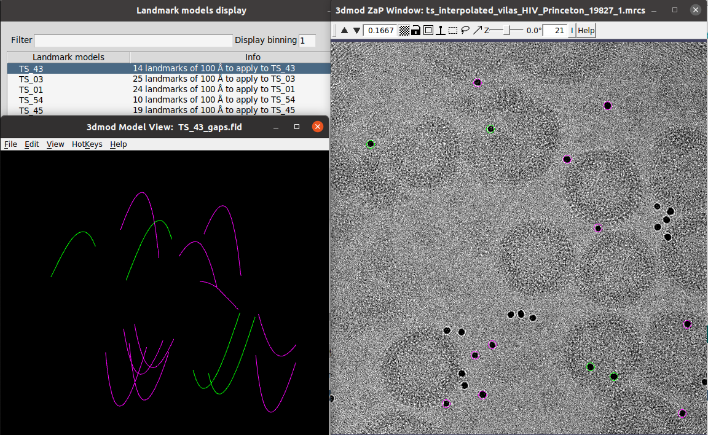

### IMOD - fiducial alignment

Once the landmark (fiducial) models are generated it is possible to calculate the final alignment of the tilt-series. To do that the protocol `imod - fiducial alignment` will be used. In this final stage not only the translational movements (shifts) are corrected, basically inherited from the prealignment correction, but also the rotation of the images (angle), aligning the tilt axis with the vertical (Y) axis of the image. 

> **Note**: Scipion uses the imod convention putting the tilt axis in the vertical (Y-axis)

The protocol `imod -fiducial alignment` will make use of the `SetOfLandmarkModels` as result of the previous protocol and will try to solve the geometry to find the transformation matrix per tilt image that explains the landmark model as rotations of the sample around the Y axis.  

To execute the protocol the next paramaters are used:
- **Input**:
-- **Fiducial model**: The set of landmarks obtained in the previous protocol, `imod - generate fiducial model`.
-- **Assume beads on two surfaces**: Yes
-- **Generate interpolated tilt series**: Yes at binning 4
-- **Assume beads on two surfaces**: Yes
- **Global variables**:
-- **Rotation solution type**: Group tilt angles, size 5
-- **Tilt angle solution type**: Yes at binning 2
-- **Distorsion solution type**: Disable

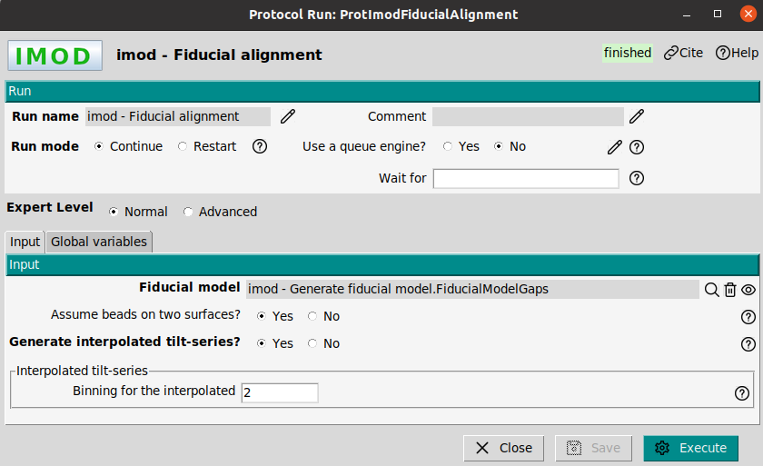

> **Tip**: To validate the tilt series alignment, the output interpolated tilt series should be visualized. 

This protocol also generates a refined SetOfLandmarkModels with no gaps, meaning that the position of the landmark lost for some images in the previous steps are now interpolated from the transformation matrices calculated. The protocol also generates a setOfCoordinates3D. These are the coordinates of the fiducials (gold beads) in the third-dimensional space, being possible to calculate their positions because we already know the final alignment.

The output tilt series as result of the alignment process can be visualized with the `TomoViewer`. In the figure, it is shown the output tilt series with the alignment (+ali). If the mouse is place on a tilt image, the associated transforation matrix to that tilt image appears. The shown rot, shiftX and shiftY are the rotation and shift extracted from the tilt image following the imod convention.

> **Note**: The output tilt series present a dose equal to zero. This is because the tilt series were dose filtered in a previous step.

> **Tip**: The `TomoViewer` can be used to check the transformation matrix, the refined tilt angles.

# Assign transformation matrix to Tilt series

When the dose filter was applied to align the tilt series, the dose of the aligned tilt series is set to zero and the tilt aligned tilt series are low pass filtered according to the accumulated dose. Despite the tilt series are aligned, they have lack of high resolution information that can be usefull for a subtomogram averaging approach. For this reason, it would be usefull to assign the alignment information to the tilt non-dose filtered tilt series. This task can be carried out with the protocol `tomo - tilt-series assign alignment`. The protocol involves two tilt series: One to take the alignment and other to set the alignment. In this tutorial the transformation matrix from the alignment will be set to the output of the x-ray eraser tilt series.

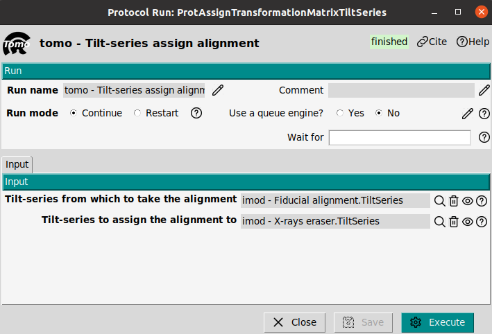

If the output tilt series of this protocol are opened with the `TomoViewer`, the dose of the tilt images will be different than zero. This indicated that this set of tilt series has not been filtered by dose, see figure.

# CTF estimation with CTFfind

**Reference**: [J. Elferich et. al. 2024](https://doi.org/10.7554/eLife.97227.1)

**Plugin**: [scipion-em-cistem](https://github.com/scipion-em/scipion-em-cistem)

The CTF estimation is a critical task to achieve high resolution in Subtomogram Averaging, or even to visualize fine details in cellular environments. The CTF correction attempts to compensate for the loss of information that the microscope introduces as a consequence of aberrations and defocus.

> **Tip**: The CTF should be estimated with the raw tilt series without any kind of preprocessing. The use of dose filters, or alignment can change the spectral properties of the tilt series, and throw inaccuracies in the CTF estimation.

The CTF will be estimated with the protocol `cistem - tilt-series ctffind`. The critical parameters are:

- **FFT box size**: 512 px as default value. 
- **Resolution (A)**: Min 50A and max 5A
- **Defocus range**: In this case from 10000 to 50000 A.
- **Defocus Step**: 500 A
- **Phase shift**: No

> **Tip**: A narrow defocus range ensure a better defocus estimation. A good approah is to provide a range centered in the nominal defocus of the tilt series acquisition. This information is contained in the mdoc files.

The result of any CTF estimation that can be visualized by clicking on Analyze results or alternatively by right-clicking on the output, in the Summary panel (low area of the main Scipion window). The viewer will open a window with the list of SetOfCTFTomoSeries corresponding to each tilt series. In this window the defocus, astigmatism and resolution associated to each tilt image can be visualized. Also, the window presents a summary plot with the defocus and resolution per tilt image. This plot will be of special interest to validate the estimation of the CTF.

# Excluding views and CTFs

**Reference**: [J. Jimenez de la Morena et.at. 2022](https://doi.org/10.1016/j.jsb.2022.107872)

**Plugin**: [scipion-em-tomo](https://github.com/scipion-em/scipion-em-tomo)

ScipionTomo provides viewers to exclude views in the tilt series of CTF estimations.

## Excluding views

Views or tilt images can be excluded with the `TomoViewer`. The main reasons to exclude a tilt image are:
- **Bad quality image**: The tilt image is dark, presents stripes or was exposed to a high dosee.
- **Misaligned image**: The tilt image is misaligned. The tilt series sequence presents a *jump* at that tilt angle, making a non smooth transition between images.

To exclude a tilt images just select the corresponding image and press the `space`, alternatively it can be marked by clicking on the exclude box. The excluded images will be highlighted in red. Finally, it is neccesary to generate a new set of tilt series by clicking on the botton `Save`. This botton opens a new window asking if the user wants to re-stack the tilt series, or if the user preffer to mark the tilt images as excluded. The differences are the next ones:

- **Re-stack**: A new stack of tilt series will be created without the excluded views. From this point the later protocols will not have access to the excluded views.
- **Marked as excluded**: The excluded views are marked but not removed from the stack. The later protocols will process these images (if it is possible, this depends on the protocol), but they will be kept marked as excluded. This allows to rescue the views.

## Excluding CTFs

CTF can be excluded with the `CTFTomoViewer`. The main reasons to exclude a CTF is a bad estimation of the defocus value, or a high astigmatism. To exclude a CTF just select the corresponding CTF and press the `space`, alternatively it can be marked by clicking on the exclude box. The excluded CTFs will be highlighted in red. Finally, it is neccesary to generate a new set of CTF by clicking on the botton `Generate subsets`. 

# CTF correction

**Reference**: [J.R. Kremer 1996](https://doi.org/10.1006/jsbi.1996.0013)

**Plugin**: [scipion-em-imod](https://github.com/scipion-em/scipion-em-imod)

> Note: Scipion has a standard CTF model, when the CTF is estimated with any CTF method, the output is stored in the Scipion standard. Thus, to correct the CTF Scipion converts the standard to the corresponding package.

The CTF correction can be performed with the protocol `imod - correct CTF`. The input of this protocol are the tilt series to be CTF-corrected and a set of CTFs previously estimated. The tilt series will be the ones we assigned the alignment information. The used parameters for this protocol will be left as default parameters.

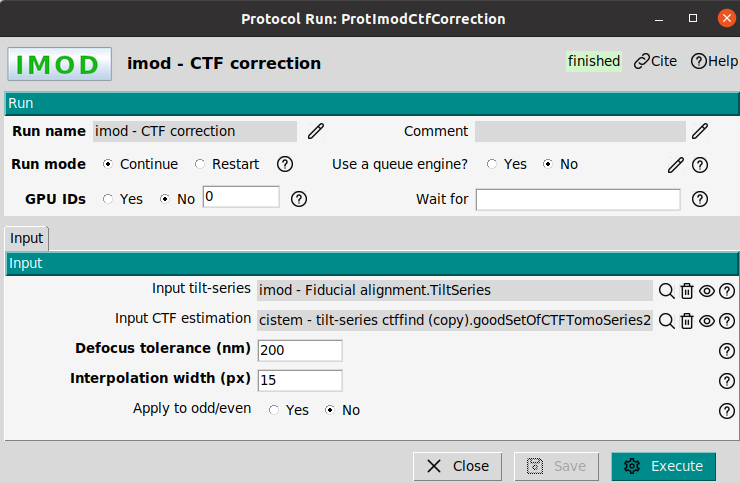

# Tilt series preprocess

**Reference**: [J.R. Kremer 1996](https://doi.org/10.1006/jsbi.1996.0013)

**Plugin**: [scipion-em-imod](https://github.com/scipion-em/scipion-em-imod)

The CTF-corrected tilt series will be the input data for a later tomogram reconstruction. Up to this step we have worked with the full-size tilt series (binning 1). IF the tomograms are reconstructed at bin 1, they will be very heavy. To safe disc and enhance the SNR of the tomogram the tilt series will be binned in a factor 4. The protocol `imod - preprocess tilt series` allows to perform different preprocessing operation on the tilt series, as binning or adjusting the gray values. In this case a binning 4 will be applied

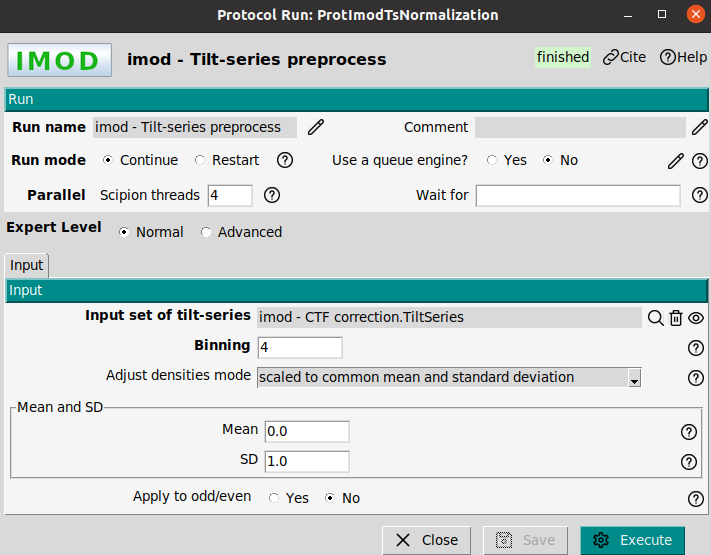

# Tomogram reconstruction with tomo3D

**Reference**: [J.I. Agulleiro 2011](https://doi.org/10.1093/bioinformatics/btq692)[J.I. Agulleiro 2015](https://doi.org/10.1016/j.jsb.2014.11.009)

**Plugin**: [scipion-em-tomo3d](https://github.com/scipion-em/scipion-em-tomo3d)

To reconstruct the tomogram from the tilt series the protocol `tomo3d - reconstruct tomogram`. The difference between both protocols is the reconstruction algorithm, meanwhile imod uses Weighted Back Projection (WBP), tomo3d makes use of a SIRT method. The tomogram will be reconstructed 

> **Tip**: WBP is faster than the SIRT method, but SIRT provides higher contrast. To visualize cellular enviroments SIRT is recommended, or to pick subtomogram with a template matching approach. If classical subtomogram averaging is going to be carried out, WBP is recommended.

The input of the reconstruction will be CTF corrected tilt series at bin 4. A SIRT recontruction is recommended in this case to produced high contrast tomograms. The `Tomogram Thickness` was set to 300 voxels.

The output can be visualized by clicking on Analyze results or alternatively by choosing the visualization tool by right-clicking on the output in the Summary box.

# Directional picking with dynamo

**Reference**: [J.I. Agulleiro 2011](https://doi.org/10.1093/bioinformatics/btq692)

**Plugin**: [scipion-em-dynamo](https://github.com/scipion-em/scipion-em-dynamo)

This picker is quite flexible and it is designed to pick broad variety of geometries: vesicles, spheres, or filaments among other. The input of this protocol only requires the set of tomograms to be picked. It is composed by two steps:
- **dynamo - vectorial picking**: This step aims to pick a set of points that define a mesh. The mesh would represent a first approach to the geometry to be picked.
- **dynamo - model workflow**: The previous meshed will be fitted to the selected geometrical model. Then, random points will be selected on the mesh as coordinates of the particles.
  
This section shows how to pick with dynamo, however, to avoid the manual task of picking a set of coordinates is also provided in a file. These coordinates can be imported in Scipion.

## Dynamo vectorial picking

In the reconstructed tomograms it is possible to observed different HIV virus. In our case we are interested in the reconstruction of structure of the immature capsid lattice. It is neccesary to identify the capsid in the tomograms. To do that the protocol `dynamo - vectorial picking` can be used. The parameter boxsize only has visualization purpose on the tomogram, it does not affect to the picked coordinates.

When the protocol is executed, a list of tomograms to be picked will appear in a new window. By double clicking on a tomogram the dynamo picking interface will be opened. The virus will be manually picked using an ellipsoidal vesicle model, as it is shown in the figure. Then, it will be neccesary to select on the capsid contour placing the mouse pointer on the capsid and using the key `c` to fix a marker. Once the capsid of a virus has been picked, a new model (ellipsoidal vesicle) will be created and the process repeated until end with the picking of all viruses presented the tomogram. Then, the dynamo interface can be closed and the list window with the list of tomogram will be updated with the number of picked coordinates in the already picked tomogram.

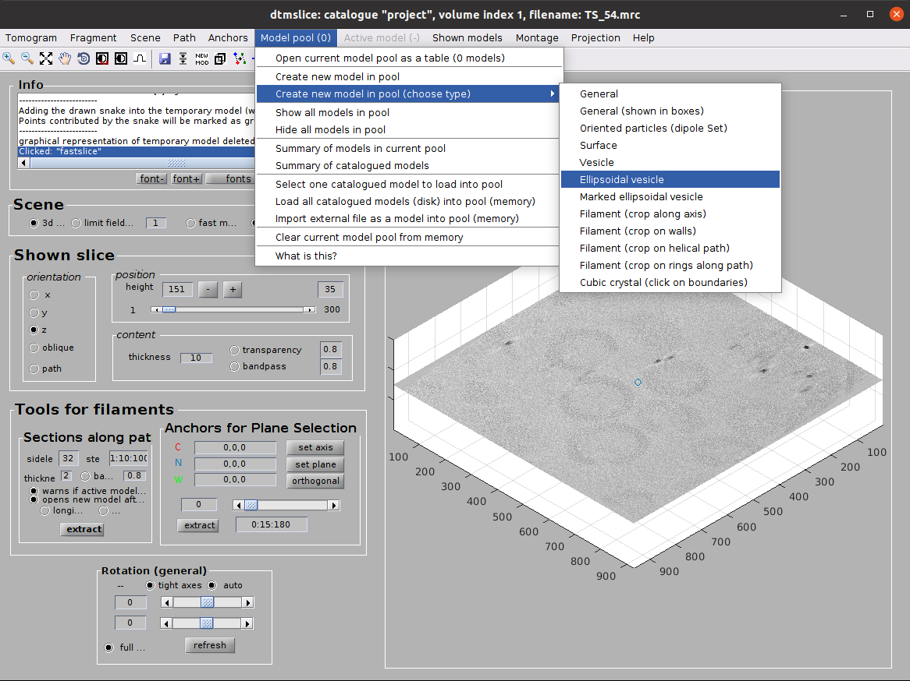

> **Note**: Dynamo picker is an oriented picker. This means that the picked coordinates have an orientation (transformation matrix). The orientation will be the normal direction to the picked surface.

## Dynamo model workflow

The protocol `dynamo - model workflows` uses the picked set of meshed as result of the protocol `dynamo - vectorial picking` and provides a 

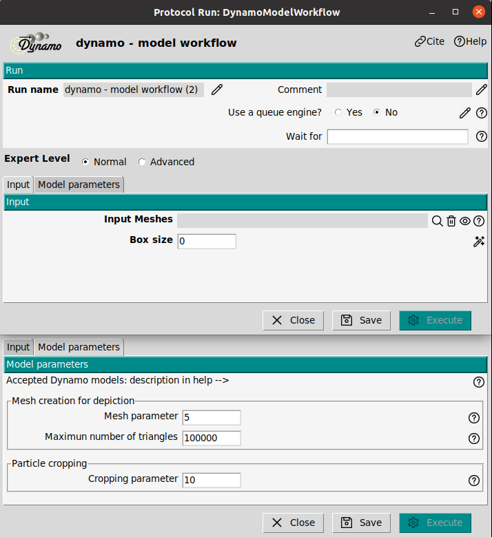

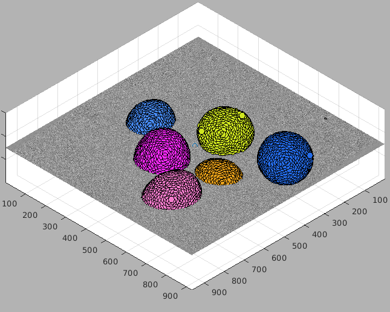

## Importing coordinates

To avoid the manual picking, a sqlite file with all picked coordinates for this data set is provided. This file can be found in the downloaded dataset. The file contains the result of the protocol `dynamo - model workflow`. Importing these coordinates the result of the model workflow is simulated. Thus, it is avoided the manual picking with dynamo. To import the coordinates in Scipion, the protocol `tomo - import 3D coordinates from Scipion` can be used. The protocol requires:

- **Scipion sqlite file**:
- **Tomograms**: Set the tomogram that will be associated to the coordinates. The reconstructed tomograms with tomo3D or imod reconstruction.
- **Box size (px)**: 54 px. This only has visualization purpose. It represent the size of the plotted boxed of the picked coordinates on the tomogram.
  
> **Note**: ScipionTomo has other protocol to import coordinates that do not requires sqlite files, it is called `tomo - import coordinates`.

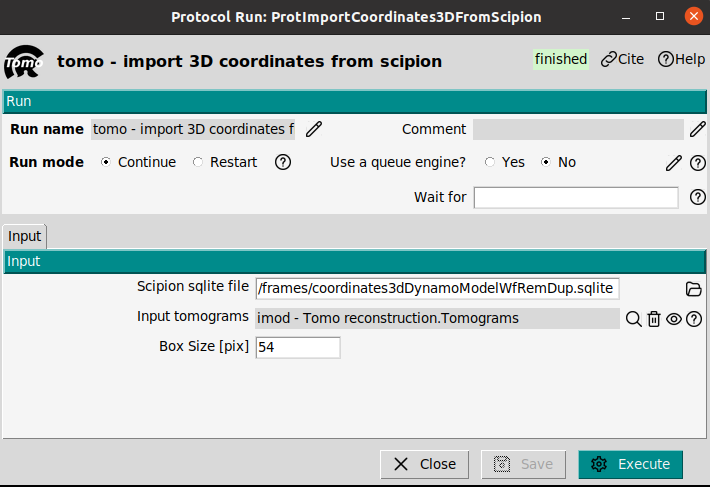

If the imported coordinates are opened with dynamo viewer, the next result should be visualized. This result is identical to the obtained one with the protocol `dynamo - model workflow`.

# Subtomogram Averaging with RelionTomo

**Reference**: [A. Burt 2024](https://doi.org/10.1002/2211-5463.13873)

**Plugin**: [scipion-em-reliontomo](https://github.com/scipion-em/scipion-em-reliontomo)

## Extract pseudo-subtomograms at bin 4

Pseudo-subtomograms are 2D cropped images or 3D-reconstructed subtomograms, premultiplied by the CTF. They do not represent physical objects. The premultiplication by the CTF, allows to avoid aliasing and speed up the computational times. The protocol `reliontomo - extract subtomos` can be used to extract the pseudo-subtomograms. This protocol allows to extract them as 2D or 3D. In this tutorial both kinds of psuedo subtomogram will be extracted. The 3D pseudo-subtomogram will be used for generating an initial volume, and the 2D pseudo-sutomograms will be used in the refinement step.

To extract the pseudo subtomograms the next input data will be required:

- **Tilt series**: They must contain the alignment information.
- **CTF estimation**: From the CTFfind estimation with the excluded views
- **Coordinates**: They are the picked coordinates. The imported coordinates will be used
- **Binning factor**: This is the scaling factor in relation to the input tilt series
- **Box size (px)**: This box size will be used to correct the CTF in the cropped particles from the tilt series
- **Croppped box size (px)**: This will be the size of the pseudo-subtomograms and therefore of the reconstructed map.
- **Write output as 2D stacks**: Set Yes for 2D pseudo-subtomograms and No for 3D pseudo-subtomograms.

> **Tip**: The 3D pseudo-subtomograms work better for obtaining a 3D initial model than the 2D pseudo-subtomograms.

## Initial model

The initial model can be estimated with the protocol `reliontomo - 3D initial model`. The input will be the extracted 3D pseudo-subtomogram at bin 6 from the previous step. 

- **Number of VDAM mini-batches**: 70. This is the number of iterations to be carried out.
- **Regularization parameter**: 4. It goes from 0 to 4. Values close to 4 put more strenght on the data.
- **Circular Mask diameter**: 500 A. A good value is to set the protein diameter
- **Symmetry group**: C6. In this case the protein has C6 symmetry. For initial volumes a C1 symmetry is recommended.
- **Prior width on tilt angle**: 10. degrees. It defines the prior on the tilt to be estimated

The result of this protocol should be similar to the one shown in the Figure. To visualize it, the average map can be opened with Scipion or Chimera.

## 3D Auto-refine

Using the initial model, it is possible to refine it to enhance the map quality pushing the resolution. The objective of this step will be to reach Nyquist resolution, and then in a later step extract the pseudo-subtomogram at a smaler pixel size. To refine the model, the protocol `reliontomo - 3D auto-refine` can be used. The input will be the extracted **2D** pseudo-subtomogram (2D not 3D) at bin 6 and the estimated initial model. The refinement parameter will be. 

- **Circular Mask diameter**: 500A. 
- **Symmetry group**: C6. In this case the protein has C6 symmetry.
- **Prior width on tilt angle**: 
- **Prior width on tilt angle**: 
- **Prior width on tilt angle**: 

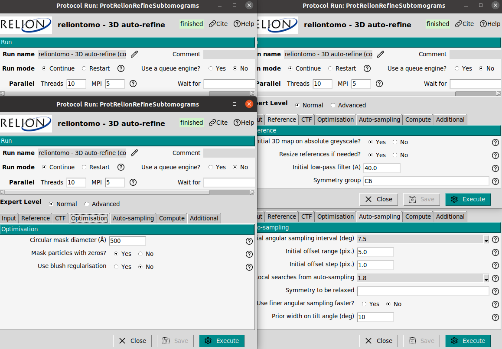

The result of this protocol should be similar to the one shown in the Figure. Note that the FSC reach Nyquist frequency allowing to reduce the binning, and the average map is in agreement with this resolution.
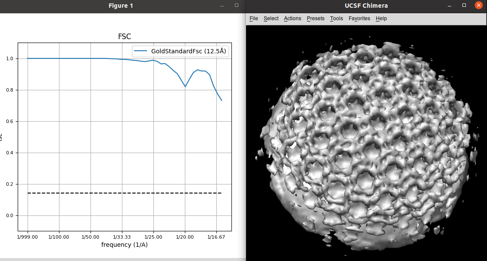

## Extract pseudo-subtomograms at bin 2

This steps shows how to reduce the binning keeping the alignment of already refined pseudo-subtomograms. The protocol `reliontomo - extract subtomos` allows this task. The parameters :

- **Coordinates**: They will be the refined pseudo-subtomograms from the 'reliontomo - 3d auto-refine`.
- **CTF**: The estimated with CTFfind with excluded views.
- **Tilt series**: The aligned ones with dose and excluded views.
- **Binning**: 2.
- **Box size (px)**: 256 px. This box size will be used to correct the CTF in the cropped particles from the tilt series
- **Croppped box size (px)**: 128 px. This will be the size of the pseudo-subtomograms and therefore of the reconstructed map.
- **Write output as 2D stacks**: Set Yes for refinin 2D pseudo-subtomograms are recommended
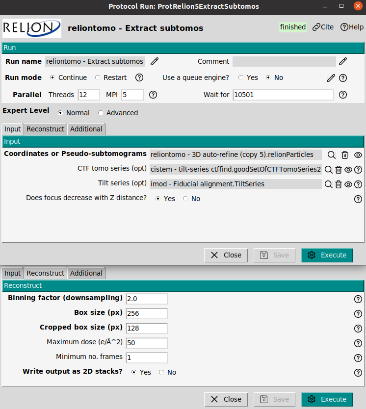

## Reconstruct particle at bin 2

In this step the refined pseudo-subtomograms from the previous autorefine are used to reconstruct the protein, but keeping their angular assignment. This is only a reconstruction step. The protocol `reliontomo - reconstruct particle` 

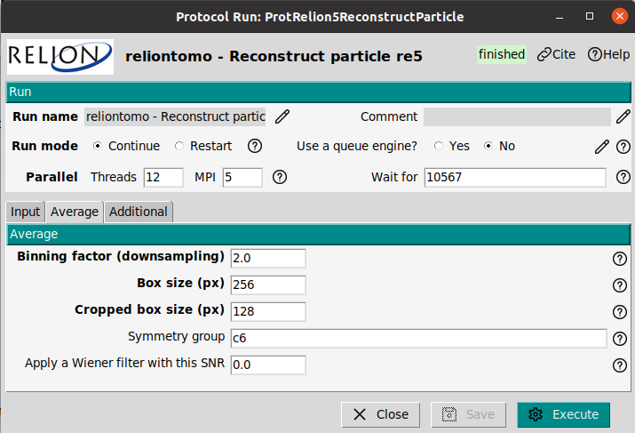

The reconstructed protein can be visualized with Scipion (to see the slices) or with Chimera (to see the 3D map). As it can be observed in the figure the map quality enhanced in comparison to the reconstruction at bin 6. 

## Refine volume at bin 2

## Remove duplicates 

However, it is observed that that reconstruction is not perfectly centered in the box, presenting a slight but not neglectible displacement along the z axis. T

## Refine volume at bin 2

# Contact us

We want to hear from you! Any comment, question, or complaints regarding this tutorial, the use of Scipion or xmipp can be sent to these emails: scipion@cnb.csic.es, xmipp@cnb.csic.es. 

Also you can follow us on our social media

Twitter: https://twitter.com/instructi2pc

Tutorials about Scipion use, and cryoEM seminars can be found on your YouTube channel

Youtube: https://www.youtube.com/user/BiocompWebs

We also have a slack channel where our most active members keep in touch daily. You can request access on scipion@cnb.csic.es

# References
- JM De la Rosa-Trevín, A Quintana, L Del Cano, et al. Scipion: A software framework toward integration, reproducibility and validation in 3D electron microscopy, Journal of Structural Biology, 195,1, 93-99 (2016).
- A. Burt, C.K. Cassidy, P. Ames, P. et al. Complete structure of the chemosensory array core signalling unit in an E. coli minicell strain. Nat Commun 11, 743 (2020).
- B. Turoňová B, M. Sikora, C. Schürmann, et. al. In situ structural analysis of SARS-CoV-2 spike reveals flexibility mediated by three hinges, Science 370 203-208 (2020)
- J.R. Kremer, D.N. Mastronarde, J.R McIntosh, Computer Visualization of Three-Dimensional Image Data Using IMOD, Journal of Structural Biology, 116, 1, 71-76 (1996)
- D.N. Mastronarde, S.R. Held, Automated tilt series alignment and tomographic reconstruction in IMOD, Journal of Structural Biology, 197, 2, 102-113 (2017)
- JI Agulleiro, JJ Fernandez. Fast tomographic reconstruction on multicore computers. Bioinformatics 27:582-583, (2011).
- JI Agulleiro, JJ Fernandez. Tomo3D 2.0--exploitation of advanced vector extensions (AVX) for 3D reconstruction. Journal of Structural Biology 189:147-152, (2015).
- A. Rohou, N. Grigorieff, CTFFIND4: Fast and accurate defocus estimation from electron micrographs, Journal of Structural Biology, 192, 2, (2015)
- M. Chen, J.M. Bell, X. Shi, X. et al. A complete data processing workflow for cryo-ET and subtomogram averaging. Nat Methods 16, 1161–1168 (2019) 
- Q. Xiong, M.K. Morphew, C.L. Schwartz, CTF Determination and Correction for Low Dose Tomographic Tilt Series, Journal of Structural Biology, 168(3) 378–387 (2009). 
- B. Turoňová, F.K.M. Schur, W. Wan, and  J.A.G. Briggs, Efficient 3D-CTF correction for cryo-electron tomography using NovaCTF improves subtomogram averaging resolution to 3.4 Å, Journal of Structural Biology, 199, 3, 187-195, 2017

