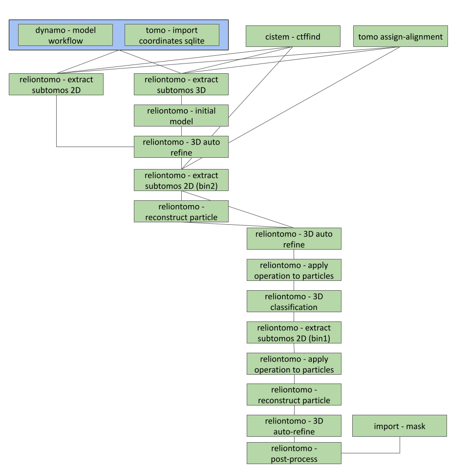
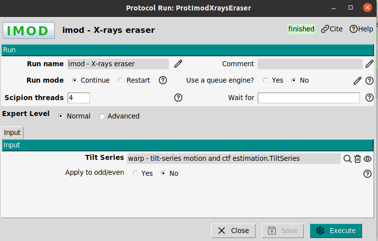
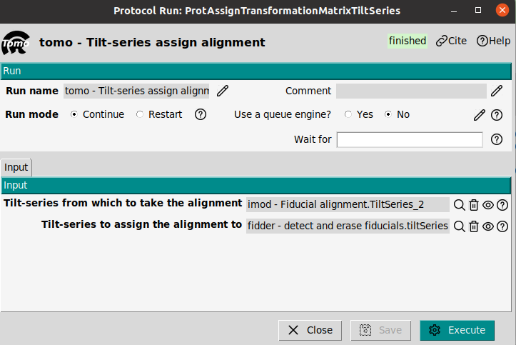
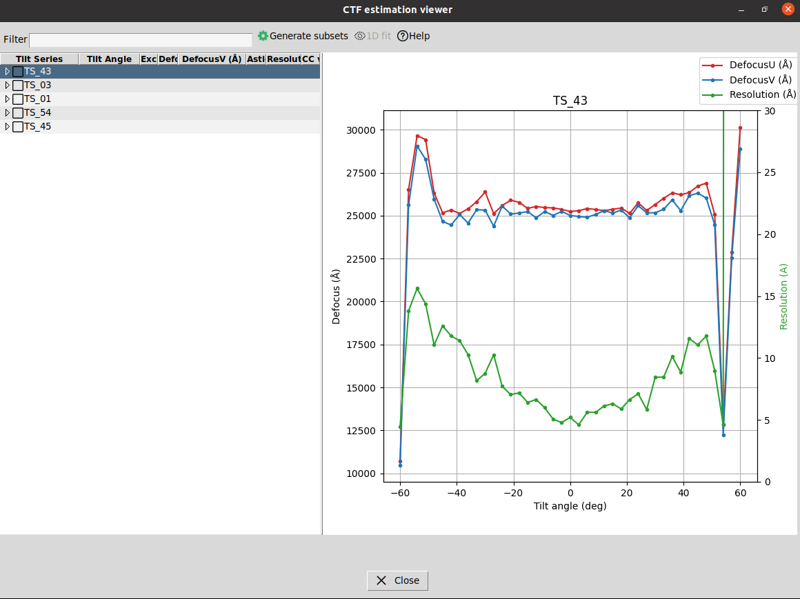
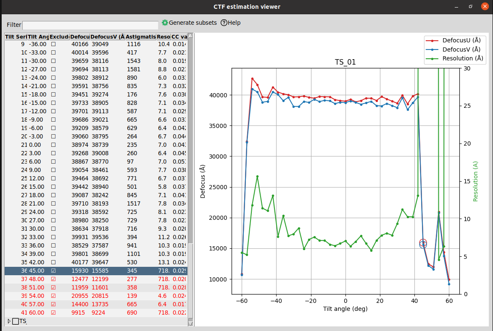
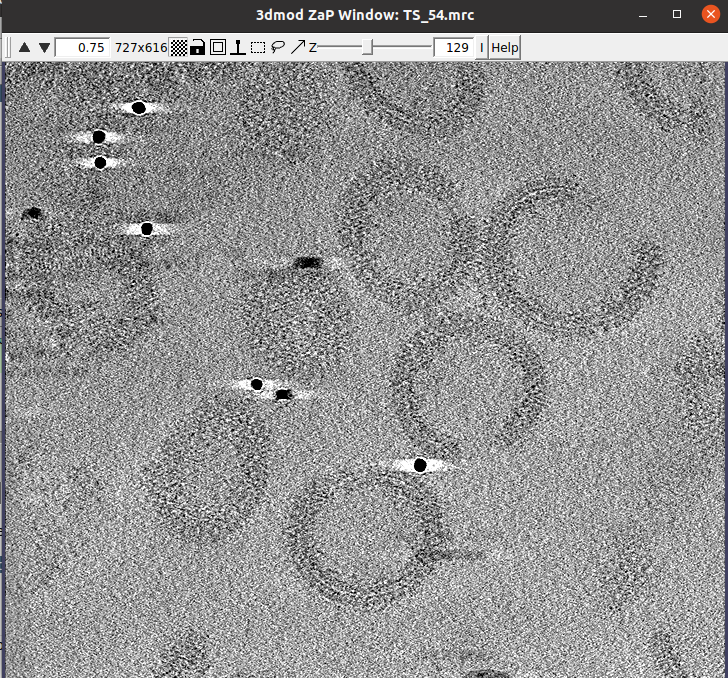
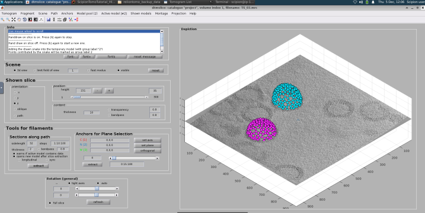
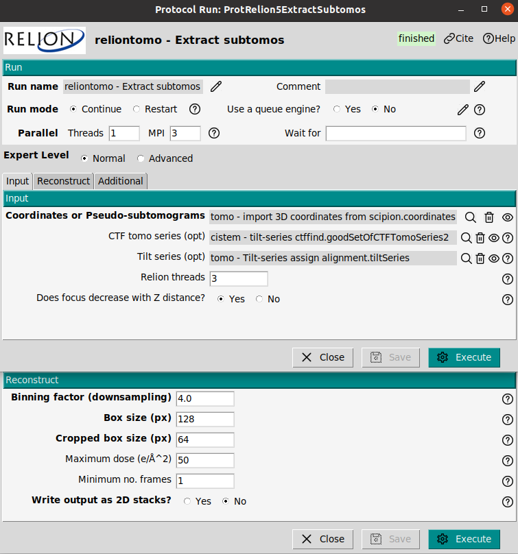
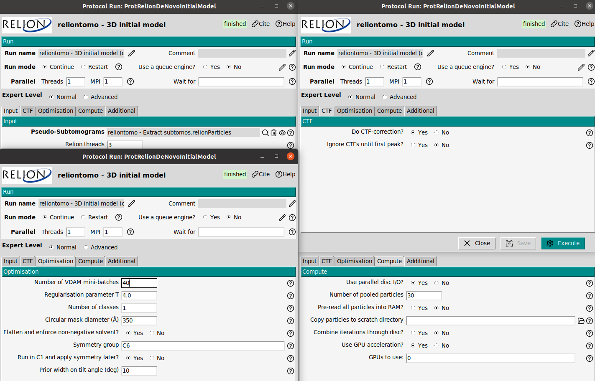

---
title: "Apoferritin tutorial with ScipionTomo"
author: [Scipion Team]
date: "2025-3-17"
subject: "Markdown"
keywords: [Markdown, Example]
subtitle: "From movies to averages"
lang: "en"

titlepage: true
titlepage-text-color: "7137C8"
titlepage-rule-color: "7137C8"
titlepage-rule-height: 2
titlepage-logo: "logo.pdf"
logo-width: 30mm
toc: true
toc-own-page: true
...

# The dataset

This tutorial can be carried out with:
- **Small dataset**: Quick tutorial with two tilt series (recommended), it obtains around 4A-5A resolution map.
- **Full dataset**: The tutorial can also be carriout with the full dataset of the EMPIAR entry [EMPIAR-10491](https://www.ebi.ac.uk/empiar/EMPIAR-10491) obtaining a resolution better than 3A.

## Small dataset tutorial 

It only contains a two tilt series. This workflow is ideal to be executed in a normal laptop with GPU. The data set can be downloaded using the next command line

> scipion3 testdata --download apoferritin_tutorial

Alternatively, the dataset can be found in the next link [https://scipion.cnb.csic.es/downloads/scipion/data/tests/apoferritin_tutorial/](https://scipion.cnb.csic.es/downloads/scipion/data/tests/apoferritin_tutorial/)

## Large dataset tutorial

The tilt series and the mdoc files can be downloaded from the entry [EMPIAR-10491](https://www.ebi.ac.uk/empiar/EMPIAR-10491)

# Workflow of this tutorial

The workflow of this tutorial can be summarized in the next figures. Use the this workflow to follow the different steps of the next sections

# Import tilt series movies

**Reference**: [J. Jimenez de la Morena et.at. 2022](https://doi.org/10.1016/j.jsb.2022.107872)

**Plugin**: [scipion-em-tomo](https://github.com/scipion-em/scipion-em-tomo)

In this step the acquired data will be imported into the Scipion framework. The protocol `tomo - import tilt series movies` allows to import different kinds of raw data. In this tutorial the raw data is a set of .mrc and .mdoc files.

> **Note**: It is mandatory that the mdoc files will be located in the same folder of the mrc files.

The .mrc files contain the acquired images, while the .mdoc files store detailed acquisition information such as sampling rate, dose per frame, and tilt axis angle. The protocol will parse the .mdoc files and store this information in the Scipion database.

Protocol parameters: Microscope voltage, spherical aberration, amplitude contrast, magnification, pixel size, tilt axis angle or dose are empty. An empty entry means that the parameter will be read from the mdoc. However, if the user introduce a parameter, Scipion will take the introduced value from the user instead of the mdoc parameter. This allows to correct possible errors in the mdoc file. 

The used parameters are shown in the Figure. The critical ones are:
- **Files directory:** Set the path of the movies. Note that the mdoc files must be in the same folder.
- **Pattern:** This tutorial uses mdoc. Set as `*.mdoc` to import all mdoc files.
- **Tomo5 mdoc:** Set as No. 
- **Microscope Voltage:** 300kV
- **Spherical Aberration:** 2.7 mm
- **Amplitude contrast:**  0.1
- **Pixel size:** Leave empty. By setting this parameter the pixel size from the mdoc will be overwritten.
- **Tilt axis angle (deg):** 85.0. By setting this parameter the pixel size from the mdoc will be overwritten.
- **Dose (e/A^2):** Initial dose 0.0, dose per tilt - leave empty. This value will be read from the mdoc file.
- **Gain image:** Set here the path to the gain image.
  

# Movie alignment and CTF estimation with Warp

**Reference**: [D. Tegunov et. al. 2021](https://doi.org/10.1038/s41592-020-01054-7)

**Plugin**: [scipion-em-warp](https://github.com/scipion-em/scipion-em-warp)

Once the tilt series movies were imported the acquired frames at each tilt angle will be aligned to obtain tilt series. The protocol `warp - tilt-series motion and ctf estimation` will find and correct the relative movement between the frames. This protocol also allows to estimate the CTF, it means the defocus, of ech tilt image.

The most important parameters are:
- **Input movies:** The imported set of tilt series movies from the previous step.
- **Binning factor:** 1.0
- **Resolution to fit:** Min 500.0  Max 10.0 A
- **B-factor:** -500.0
- **Motion model grid:** X = 1, Y = 1, Temporal = 3
- **Do even and odd:** No
- **Transpose gain reference:** No swap
- **File gain reference:** Flip X
- **EER fraction:** 16 (No matter for this dataset)
- **EER group exposure:** Leave empty (No matter for this dataset)
- **Estimate CTF:** Yes. 
- **Windows:** 512
- **Resolution: (A)** Min 30, Max 7.0
- **Defocus search range (um):** Min 0.5, Max 8.0
- **Defocus model grid**: X=2, Y=2, Temporal = 1
- **Fit phase**: No
- **Use the movie average**: No

The output of the protocol will be a set of tilt series and a set of CTFs. It is possible to visualize these set with the tomoViewer and CTFtomoViewer.

# X-ray eraser

**Reference**: [J.R. Kremer 1996](https://doi.org/10.1006/jsbi.1996.0013)

**Plugin**: [scipion-em-imod](https://github.com/scipion-em/scipion-em-imod)

The interaction of electrons with the sample can generate X-rays. They can be detected by the camera, and identified in the images as very bright pixels. Therefore, the X-ray peaks are an unwanted effect that should be corrected. The protocol `imod - Xray eraser` allows to remove these bright points. The input will be a tilt series (output of the movie alignment). This protocol also can be executed with default parameters.

The ouput of this protocol will be a set of Tilt Series that looks like almost identical to the previous ones.

# Tilt series alignment

There are many methods to align tilt series in the ScipionTomo framework, as they are:

 - IMOD
 - Aretomo
 - EmanTomo

In this tutorial IMOD will be used, however, it is absolutely possible to do this tutorial with any other of the list.

## IMOD preprocessing (binning Tilt series)

**Reference**: [J.R. Kremer 1996](https://doi.org/10.1006/jsbi.1996.0013)

**Plugin**: [scipion-em-imod](https://github.com/scipion-em/scipion-em-imod)

Before starting with the alignment of the tilt series a binning step will be carried out in order to reduce the image size, increasing the contrast (SNR) and reducing the computational burden for alinging. The protocol `imod - preprocess tilt series` allows to perform different preprocessing operation on the tilt series, as binning or adjusting the gray values. In this case the size of the tilt series will be reduced in a factor 10.

- **Tilt series**: The output of the X-ray eraser
- **Binning**: 10
- **Adjust densities mode**: scaled to common mean and standard deviation
- **Mean**: 0.0
- **Standard deviation**: 1.0

## IMOD batch run tomo

**Reference**: [J.R. Kremer 1996](https://doi.org/10.1006/jsbi.1996.0013)

**Plugin**: [scipion-em-imod](https://github.com/scipion-em/scipion-em-imod)

To align the tilt series with IMOD the protocol `imod - teamtomo/batchruntomo` will be used. The protocol can be executed with default parameters:

- **Tilt series**: The tilt series to be aligned the dose filtered one is recommened
- **Alignment mode**: Patch tracking
- **Generate interpolated tilt series**: Yes at bin 4 (just for visualization purpose)
- **Patch side-length(A)**: 500
- **Patch overlap percent**: 80

> **Note**: The output of this protocol is a set of tilt series. In the summary, the output tilt series presents a `+ali` flag. This flag informs about the alignment, the tilt series present an associated transformation matrix (with the estimated shifts). **The +ali indicates that matrix is associated as metadata but not applied to the tilt series**. To visualize the aligned tilt series the flag of the protocol `generate interpolated tilt-series` must be enable. In the summary, the interpolated tilt series can be identified with the flag `!interp`.

> **Tip**: The `TomoViewer` or can be used to check the transformation matrix, the refined tilt angles.

# Assign transformation matrix to Tilt series

When the dose filter was applied to align the tilt series, the dose of the aligned tilt series was set to zero. The does filter helped for aligning tilt series. Unfortunately, some subtomogram averaging protocols requires unfiltered tilt series, it means without dose filtering. For this reason, it would be usefull to assign the alignment information to the tilt non-dose filtered tilt series. This task can be carried out with the protocol `tomo - tilt-series assign alignment`. The protocol involves two tilt series: One to take the alignment and other to set the alignment. In this tutorial the transformation matrix from the alignment will be set to the output of the x-ray eraser tilt series (see the workflow).

Note that the output of `tomo - tilt-series assign alignment` presents a non-zero dose. This can be checked by by visualizing the tilt series with `TomoViewer`, see figure.

# CTF estimation

There are many methods to estimate the CTF in ScipionTomo, as they are:

 - CTFfind
 - gCTF
 - AreTomo
 - IMOD CTFPlotter
 - Emantomo

In this tutorial CTFfind will be used.

## CTF estimation with CTFfind

**Reference**: [J. Elferich et. al. 2024](https://doi.org/10.7554/eLife.97227.1)

**Plugin**: [scipion-em-cistem](https://github.com/scipion-em/scipion-em-cistem)

The CTF estimation is a critical step to achieve high resolution in Subtomogram Averaging, or even to visualize fine details in cellular environments. The CTF correction attempts to compensate for the loss of information that the microscope introduces as a consequence of aberrations and defocus.

> **Tip**: The CTF should be estimated with the raw tilt series without any kind of preprocessing. The use of dose filters, or alignment can change the spectral properties of the tilt series, and throw inaccuracies in the CTF estimation.

The CTF will be estimated with the protocol `cistem - tilt-series ctffind`. The critical parameters are:

- **FFT box size**: 512 px as default value. 
- **Resolution (A)**: Min 50A and max 5A
- **Defocus range**: In this case from 10000 to 50000 A.
- **Defocus Step**: 500 A
- **Phase shift**: No

> **Tip**: A narrow defocus range ensure a better defocus estimation. A good approach is to provide a range centered in the nominal defocus of the tilt series acquisition. This information is contained in the mdoc files.

The result of any CTF estimation that can be visualized by clicking on Analyze results or alternatively by right-clicking on the output, in the Summary panel (low area of the main Scipion window). The viewer will open a window with the list of SetOfCTFTomoSeries corresponding to each tilt series. In this window the defocus, astigmatism and resolution associated to each tilt image can be visualized. Also, the window presents a summary plot with the defocus and resolution per tilt image. This plot will be of special interest to validate the estimation of the CTF.

# Excluding views and CTFs

**Reference**: [J. Jimenez de la Morena et.at. 2022](https://doi.org/10.1016/j.jsb.2022.107872)

**Plugin**: [scipion-em-tomo](https://github.com/scipion-em/scipion-em-tomo)

ScipionTomo provides viewers to exclude views in the tilt series of CTF estimations. They can be carried out with the `TomoViewer` or the `CTFViewer`.

## Excluding views

Views or tilt images can be excluded with the `TomoViewer`. The main reasons to exclude a tilt image are:
- **Bad quality image**: The tilt image is dark, presents stripes or was exposed to a high dosee.
- **Misaligned image**: The tilt image is misaligned. The tilt series sequence presents a *jump* at that tilt angle, making a non smooth transition between tilt images.

To exclude a tilt images just select the corresponding image and press the `space`, alternatively it can be marked by clicking on the exclude box. The excluded images will be highlighted in red. Finally, it will be neccesary to generate a new set of tilt series by clicking on the botton `Save`. This botton opens a new window asking if the user wants to re-stack the tilt series, or if the user preffers to mark the tilt images as excluded. The differences are the next ones:

- **Re-stack**: A new stack of tilt series will be created without the excluded views. From this point the later protocols will not have access to the excluded views.
- **Marked as excluded**: The excluded views are marked but not removed from the stack. The later protocols will process these images (if it is possible, this depends on the protocol), but they will be kept marked as excluded. This allows to rescue the views.

## Excluding CTFs

CTFs can be excluded with the `CTFTomoViewer`. The main reasons to exclude a CTF are: a bad estimation of the defocus value, or a high astigmatism. To exclude a CTF just select the corresponding CTF and press the `space`, alternatively it can be marked by clicking on the exclude box. The excluded CTFs will be highlighted in red. Finally, it is neccesary to generate a new set of CTF by clicking on the botton `Generate subsets`. 

# CTF correction

**Reference**: [J.R. Kremer 1996](https://doi.org/10.1006/jsbi.1996.0013)

**Plugin**: [scipion-em-imod](https://github.com/scipion-em/scipion-em-imod)

> Note: Scipion has a standard CTF model, when the CTF is estimated with any CTF estimator, the output is converted and stored in the Scipion standard. To correct the CTF, Scipion converts the standard into the corresponding package (in this case imod).

The CTF correction can be performed with the protocol `imod - correct CTF`. The input of this protocol are the tilt series with assigned alignment and a set of CTFs previously estimated. The tilt series will be the ones we assigned the alignment information. The used parameters for this protocol will be left as default parameters.

# Tilt series preprocess

**Reference**: [J.R. Kremer 1996](https://doi.org/10.1006/jsbi.1996.0013)

**Plugin**: [scipion-em-imod](https://github.com/scipion-em/scipion-em-imod)

The CTF-corrected tilt series will be the input data for a later tomogram reconstruction. Up to this step we have worked with the full-size tilt series (binning 1). IF the tomograms are reconstructed at bin 1, they will be very heavy. To safe disc and enhance the SNR of the tomogram the tilt series will be binned. The protocol `imod - preprocess tilt series` allows to perform different preprocessing operation on the tilt series, as binning or adjusting the gray values. 

> For the tutorial that uses the small dataset, use bin 6
> For the tutorial that uses the large dataset, use bin 4

## Tomogram reconstruction

There are many methods to reconstruct tomogram in ScipionTomo framework, as they are:

 - Tomo3d
 - Imod
 - NovaCTF
 - AreTomo
 - Emantomo
 - Reliontomo

In this tutorial tomo3D will be used.

## Tomogram reconstruction with tomo3D

**Reference**: [J.I. Agulleiro 2011](https://doi.org/10.1093/bioinformatics/btq692)[J.I. Agulleiro 2015](https://doi.org/10.1016/j.jsb.2014.11.009)

**Plugin**: [scipion-em-tomo3d](https://github.com/scipion-em/scipion-em-tomo3d)

To reconstruct the tomogram from the tilt series the protocol `tomo3d - reconstruct tomogram`. Tomo3D provides two different reconstruction algorithm: Weighted Back Projection (WBP) and Simultaneous Iterative reconstruction technique (SIRT). The method of SIRT will be used.

> **Tip**: WBP is faster than the SIRT method, but SIRT provides higher contrast. To visualize cellular enviroments SIRT is recommended, or to pick subtomogram with a template matching approach. If classical subtomogram averaging is going to be carried out, WBP is recommended.

The input of the reconstruction will be the binned CTF corrected tilt series. A SIRT recontruction is recommended in this case to produced tomograms with high contrast. The `Tomogram Thickness` was set to 300 voxels.

The output can be visualized by clicking on Analyze results or alternatively by choosing the visualization tool by right-clicking on the output in the Summary box.

# Directional picking with dynamo

**Reference**: [D. Castaño-Diez et.al 2012](https://doi.org/10.1016/j.jsb.2011.12.017)

**Plugin**: [scipion-em-dynamo](https://github.com/scipion-em/scipion-em-dynamo)

This picker is quite flexible and it is designed to pick broad variety of geometries: vesicles, spheres, or filaments among other. The input of this protocol only requires the set of tomograms to be picked. It is composed by two steps:
- **dynamo - vectorial picking**: This step aims to pick a set of points that define a mesh. The mesh would represent a first approach to the geometry to be picked.
- **dynamo - model workflow**: The previous meshed will be fitted to the selected geometrical model. Then, random points will be selected on the mesh as coordinates of the particles.
  
This section shows how to pick with dynamo, however, to avoid the manual task of picking a set of coordinates is also provided in a file. These coordinates can be imported in ScipionTomo.

## Dynamo vectorial picking

The reconstructed present several several HIV virus. In our case we are interested in the reconstruction of structure of the immature capsid lattice. To do that, tt is neccesary to identify the capsid in the tomograms. The protocol `dynamo - vectorial picking` will be used. The parameter boxsize only has a visualization purpose (size of the plotted points on the tomogram), it does not affect to the picked coordinates. 

> **Note**: For the small set tutorial only one or two viruses will be picked. For the large dataset tutorial, all viruses will be picked. To avoid manual picking the coordinates can be imported later in te tutorial.

When the protocol is executed, a new window with the list of tomograms to be picked will appear. By double clicking on a tomogram the dynamo picking interface will be opened. Dynamo hsa different kinds of geometrical pickers. Due to the geometry of the HIV virus an ellipsoidal vesicle model will be used to fit the geometry of the HIV. By means of this model, the virus capsid will be manually picked, as it is shown in the figure. Then, it will be neccesary to select on the capsid contour placing the mouse pointer on the capsid and using the key `c` to fix a marker. Once the capsid of a virus has been picked, a new model (ellipsoidal vesicle) will be created and the process repeated until end with the picking of all viruses presented the tomogram. Then, the dynamo interface can be closed and the list window with the list of tomogram will be updated with the number of picked coordinates in the already picked tomogram.

It is not neccesary to pick the complete surface of the virus, dynamo just requires some points to complete the virus geometry as it is shown in the figure

> **Note**: Dynamo picker is an oriented picker. This means that the picked coordinates have an orientation (transformation matrix). The orientation will be the normal direction to the picked surface.

> **Warning**: The output of this protocol is a set of meshes, not coordinates. The meshes will be used by the next protocol to fit the geometry (ellipsoid) and and pick on it.

## Dynamo model workflow

The protocol `dynamo - model workflows` uses the picked set of meshed as result of the protocol `dynamo - vectorial picking` and provides a 

## Importing coordinates

To avoid the manual picking, a sqlite file with all picked coordinates for this data set is provided. This file can be found in the downloaded dataset. The file contains the result of the protocol `dynamo - model workflow`. The import aims to sumimulate the result of the model workflow. Thus, the manual picking with dynamo is avoided simplifying the tutorial. To import the coordinates in Scipion, the protocol `tomo - import 3D coordinates from Scipion` can be used. The protocol requires:

- **Scipion sqlite file**:
- **Tomograms**: Set the tomogram that will be associated to the coordinates. The reconstructed tomograms with tomo3D or imod reconstruction.
- **Box size (px)**: 54 px. This only has visualization purpose. It represents the size of the plotted boxed of the picked coordinates on the tomogram.
  
> **Note**: ScipionTomo has other protocol to import coordinates that do not requires sqlite files, it is called `tomo - import coordinates`.

If the imported coordinates are opened with dynamo viewer, the next result should be visualized. This result is identical to the obtained one with the protocol `dynamo - model workflow`.

# Subtomogram Averaging with RelionTomo

**Reference**: [A. Burt 2024](https://doi.org/10.1002/2211-5463.13873)

**Plugin**: [scipion-em-reliontomo](https://github.com/scipion-em/scipion-em-reliontomo)

## Extract pseudo-subtomograms at bin 6

Pseudo-subtomograms are 2D cropped images or 3D-reconstructed subtomograms, premultiplied by the CTF. They do not represent physical objects. The premultiplication by the CTF, allows to avoid aliasing and speed up the computational times. The protocol `reliontomo - extract subtomos` can be used to extract the pseudo-subtomograms. This protocol allows to extract them as 2D or 3D. In this tutorial both kinds of psuedo subtomogram will be extracted. The 3D pseudo-subtomogram will be used for generating an initial volume, and the 2D pseudo-sutomograms will be used in the refinement step.

To extract the pseudo subtomograms the next input data will be required:

- **Tilt series**: They must contain the alignment information.
- **CTF estimation**: From the CTFfind estimation with the excluded views
- **Coordinates**: They are the picked coordinates. The imported coordinates will be used
- **Binning factor**: 6 This is the scaling factor in relation to the input tilt series
- **Box size (px)**: 128. This box size will be used to correct the CTF in the cropped particles from the tilt series
- **Croppped box size (px)**: 64. This will be the size of the pseudo-subtomograms and therefore of the reconstructed map.
- **Write output as 2D stacks**: Set Yes for 2D pseudo-subtomograms and No for 3D pseudo-subtomograms.

> **Note** This protocol will be executed twice using the same parameters, but first writing output as 3D and later as 2D pseudo-subtomogram. 

> **Tip**: The 3D pseudo-subtomograms work better for obtaining a 3D initial model than the 2D pseudo-subtomograms.

## Initial model

The initial model can be estimated with the protocol `reliontomo - 3D initial model`. The input will be the extracted 3D pseudo-subtomogram at bin 6 from the previous step. 

- **Number of VDAM mini-batches**: 70 large dataset, 40 small dataset. This is the number of iterations to be carried out.
- **Regularization parameter**: 4. It goes from 0 to 4. Values close to 4 put more strenght on the data.
- **Circular Mask diameter**: 350 A. A good value is to set the protein diameter
- **Symmetry group**: C6. In this case the protein has C6 symmetry. For initial volumes a C1 symmetry is recommended.
- **Prior width on tilt angle**: 10. degrees. It defines the prior on the tilt to be estimated

The result of this protocol should be similar to the one shown in the Figure. To visualize it, the average map can be opened with Scipion or Chimera.

## 3D Auto-refine

Using the initial model, it is possible to refine it to enhance the map quality pushing the resolution. The objective of this step will be to reach Nyquist resolution, and then in a later step extract the pseudo-subtomogram at a smaler pixel size. To refine the model, the protocol `reliontomo - 3D auto-refine` can be used. The input will be the extracted **2D** pseudo-subtomogram (2D not 3D) at bin 6 and the estimated initial model. The refinement parameter will be. 

- **Pseudo-subtomograms**: The extracted 2D-pseudosubtomograms
- **Reference volume**: The obtained initial volume
- **Is initial 3D map on absolute greyscale?1**: Yes
- **Resize references if needed?**: Yes
- **Initial low-pass filter (A)**: 60A
- **Symmetry group**: C6. In this case the protein has C6 symmetry
- **Do CTF-correction?**: Yes
- **Ignore CTF until first peak?**: No
- **Circular Mask diameter**: 350A.
- **Mask particles with zeros**: Yes
- **Use blush regularization**: No
- **Initial angular sampluing interval**: 7.5 deg
- **Initial offset range (px)**: 5 px
- **Initial offset step (px)**: 1 px
- **Local searches from auto-sampling**: 1.8 deg
- **Symmetry to be relaxed**: Leave empty
- **Use finer angulat sampling faster**: No
- **Prior width on tilt angle**: 10 deg

The result of this protocol should be similar to the one shown in the Figure. Fpr the latge dataset the FSC should reach Nyquist, for the small data set with 1-2 picked viruses the FSC should be close to Nyquist, around 20A resolution. If Nyquist resolution is reached, the next step will be to reduce the binning refining again the obtained map
.

## Extract pseudo-subtomograms at bin 2

This steps shows how to reduce the binning keeping the alignment of already refined pseudo-subtomograms. The protocol `reliontomo - extract subtomos` allows this task. The parameters :

- **Coordinates**: They will be the refined pseudo-subtomograms from the 'reliontomo - 3d auto-refine`.
- **CTF**: The estimated with CTFfind with excluded views.
- **Tilt series**: The aligned ones with dose and excluded views.
- **Binning**: 2.
- **Box size (px)**: 256 px. This box size will be used to correct the CTF in the cropped particles from the tilt series
- **Croppped box size (px)**: 128 px. This will be the size of the pseudo-subtomograms and therefore of the reconstructed map.
- **Write output as 2D stacks**: Set Yes for refinin 2D pseudo-subtomograms are recommended

## Reconstruct particle at bin 2

In this step the refined pseudo-subtomograms from the previous autorefine are used to reconstruct the protein, but keeping their angular assignment. This is only a reconstruction step. The protocol `reliontomo - reconstruct particle` 

The reconstructed protein can be visualized with Scipion (to see the slices) or with Chimera (to see the 3D map). As it can be observed in the figure the map quality enhanced in comparison to the reconstruction at bin 6. 

## Refine volume at bin 2

# Contact us

We want to hear from you! Any comment, question, or complaints regarding this tutorial, the use of Scipion or xmipp can be sent to these emails: scipion@cnb.csic.es, xmipp@cnb.csic.es. 

Also you can follow us on our social media

Twitter: https://twitter.com/instructi2pc

Tutorials about Scipion use, and cryoEM seminars can be found on your YouTube channel

Youtube: https://www.youtube.com/user/BiocompWebs

We also have a slack channel where our most active members keep in touch daily. You can request access on scipion@cnb.csic.es

# References
- JM De la Rosa-Trevín, A Quintana, L Del Cano, et al. Scipion: A software framework toward integration, reproducibility and validation in 3D electron microscopy, Journal of Structural Biology, 195,1, 93-99 (2016).
- A. Burt, C.K. Cassidy, P. Ames, P. et al. Complete structure of the chemosensory array core signalling unit in an E. coli minicell strain. Nat Commun 11, 743 (2020).
- B. Turoňová B, M. Sikora, C. Schürmann, et. al. In situ structural analysis of SARS-CoV-2 spike reveals flexibility mediated by three hinges, Science 370 203-208 (2020)
- J.R. Kremer, D.N. Mastronarde, J.R McIntosh, Computer Visualization of Three-Dimensional Image Data Using IMOD, Journal of Structural Biology, 116, 1, 71-76 (1996)
- D.N. Mastronarde, S.R. Held, Automated tilt series alignment and tomographic reconstruction in IMOD, Journal of Structural Biology, 197, 2, 102-113 (2017)
- JI Agulleiro, JJ Fernandez. Fast tomographic reconstruction on multicore computers. Bioinformatics 27:582-583, (2011).
- JI Agulleiro, JJ Fernandez. Tomo3D 2.0--exploitation of advanced vector extensions (AVX) for 3D reconstruction. Journal of Structural Biology 189:147-152, (2015).
- A. Rohou, N. Grigorieff, CTFFIND4: Fast and accurate defocus estimation from electron micrographs, Journal of Structural Biology, 192, 2, (2015)
- M. Chen, J.M. Bell, X. Shi, X. et al. A complete data processing workflow for cryo-ET and subtomogram averaging. Nat Methods 16, 1161–1168 (2019) 
- Q. Xiong, M.K. Morphew, C.L. Schwartz, CTF Determination and Correction for Low Dose Tomographic Tilt Series, Journal of Structural Biology, 168(3) 378–387 (2009). 
- B. Turoňová, F.K.M. Schur, W. Wan, and  J.A.G. Briggs, Efficient 3D-CTF correction for cryo-electron tomography using NovaCTF improves subtomogram averaging resolution to 3.4 Å, Journal of Structural Biology, 199, 3, 187-195, 2017

