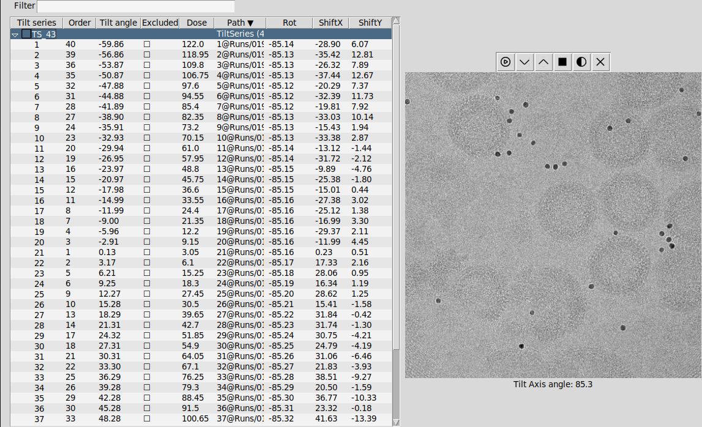
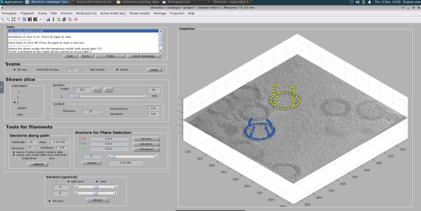
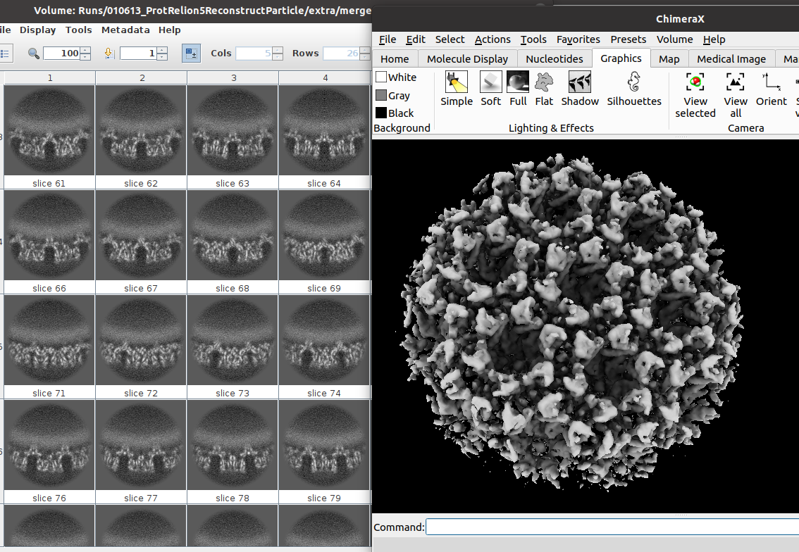

---
title: "Apoferritin tutorial with ScipionTomo"
author: [Scipion Team]
date: "2025-3-17"
subject: "Markdown"
keywords: [Markdown, Example]
subtitle: "From movies to averages"
lang: "en"

titlepage: true
titlepage-text-color: "7137C8"
titlepage-rule-color: "7137C8"
titlepage-rule-height: 2
titlepage-logo: "logo.pdf"
logo-width: 30mm
toc: true
toc-own-page: true
...

# The dataset

This tutorial can be carried out with:
- **Small dataset**: Quick tutorial with two tilt series (recommended), it obtains around 4A-5A resolution map.
- **Full dataset**: The tutorial can also be carriout with the full dataset of the EMPIAR entry [EMPIAR-10491](https://www.ebi.ac.uk/empiar/EMPIAR-10491) obtaining a resolution better than 3A.

## Small dataset tutorial 

It only contains two tilt series. This workflow is ideal to be executed in a normal laptop with GPU. The data set can be downloaded using the next command line

> scipion3 testdata --download apoferritin_tutorial

Alternatively, the dataset can be found in the next link [https://scipion.cnb.csic.es/downloads/scipion/data/tests/apoferritin_tutorial/](https://scipion.cnb.csic.es/downloads/scipion/data/tests/apoferritin_tutorial/)

## Large dataset tutorial

The tilt series and the mdoc files can be downloaded from the entry [EMPIAR-10491](https://www.ebi.ac.uk/empiar/EMPIAR-10491)

# Import tilt series movies

**Reference**: [J. Jimenez de la Morena et.at. 2022](https://doi.org/10.1016/j.jsb.2022.107872)

**Plugin**: [scipion-em-tomo](https://github.com/scipion-em/scipion-em-tomo)

In this step the acquired data will be imported into the Scipion framework. The protocol `tomo - import tilt series movies` allows to import different kinds of raw data. In this tutorial the raw data is a set of .mrc and .mdoc files.

> **Note**: It is mandatory that the mdoc files will be located in the same folder of the mrc files.

The .mrc files contain the acquired images, while the .mdoc files store detailed acquisition information such as sampling rate, dose per frame, and tilt axis angle. The protocol will parse the .mdoc files and store this information in the Scipion database.

Protocol parameters: Microscope voltage, spherical aberration, amplitude contrast, magnification, pixel size, tilt axis angle or dose are empty. An empty entry means that the parameter will be read from the mdoc. However, if the user introduce a parameter, Scipion will take the introduced value from the user instead of the mdoc parameter. This allows to correct possible errors in the mdoc file. 

The used parameters are shown in the Figure. The critical ones are:
- **Files directory:** Set the path of the movies. Note that the mdoc files must be in the same folder.
- **Pattern:** This tutorial uses mdoc. Set as `*.mdoc` to import all mdoc files.
- **Tomo5 mdoc:** Set as No. 
- **Microscope Voltage:** 300kV
- **Spherical Aberration:** 2.7 mm
- **Amplitude contrast:**  0.1
- **Pixel size:** Leave empty. By setting this parameter the pixel size from the mdoc will be overwritten.
- **Tilt axis angle (deg):** 85.0. By setting this parameter the pixel size from the mdoc will be overwritten.
- **Dose (e/A^2):** Initial dose 0.0, dose per tilt - leave empty. This value will be read from the mdoc file.
- **Gain image:** Set here the path to the gain image.
  

# Movie alignment and CTF estimation with Warp

**Reference**: [D. Tegunov et. al. 2021](https://doi.org/10.1038/s41592-020-01054-7)

**Plugin**: [scipion-em-warp](https://github.com/scipion-em/scipion-em-warp)

Once the tilt series movies were imported the acquired frames at each tilt angle will be aligned to obtain tilt series. The protocol `warp - tilt-series motion and ctf estimation` will find and correct the relative movement between the frames. This protocol also allows to estimate the CTF, it means the defocus of ech tilt image.

The most important parameters are:
- **Input movies:** The imported set of tilt series movies from the previous step.
- **Binning factor:** 1.0
- **Resolution to fit:** Min 500.0  Max 10.0 A
- **B-factor:** -500.0
- **Motion model grid:** X = 1, Y = 1, Temporal = 3
- **Do even and odd:** No
- **Transpose gain reference:** No swap
- **File gain reference:** Flip X
- **EER fraction:** 16 (No matter for this dataset)
- **EER group exposure:** Leave empty (No matter for this dataset)
- **Estimate CTF:** Yes. 
- **Windows:** 512
- **Resolution: (A)** Min 30, Max 7.0
- **Defocus search range (um):** Min 0.5, Max 8.0
- **Defocus model grid**: X=2, Y=2, Temporal = 1
- **Fit phase**: No
- **Use the movie average**: No

The output of the protocol will be a set of tilt series and a set of CTFs. It is possible to visualize these set with the `TomoViewer` and `CTFtomoViewer`.

# Excluding views and CTFs

## Excluding views

> There is no need to exclude views for this dataset. The reader can do it if he wishes.

## Excluding CTFs

CTFs can be excluded with the `CTFTomoViewer`. The main reasons to exclude a CTF are: a bad estimation of the defocus value, or a high astigmatism. To exclude a CTF just select the corresponding CTF and press the `space`. Alternatively, it can be marked by clicking on the exclude box. The excluded CTFs will be highlighted in red. Finally, it is neccesary to generate a new set of CTF by clicking on the botton `Generate subsets`. 

# X-ray eraser

**Reference**: [J.R. Kremer 1996](https://doi.org/10.1006/jsbi.1996.0013)

**Plugin**: [scipion-em-imod](https://github.com/scipion-em/scipion-em-imod)

The interaction of electrons with the sample can generate X-rays. They can be detected by the camera, and identified in the images as very bright pixels. Therefore, the X-ray peaks are an unwanted effect that should be corrected. The protocol `imod - Xray eraser` allows to remove these bright points. The input will be a tilt series (output of the movie alignment). This protocol also can be executed with default parameters.

The ouput of this protocol will be a set of Tilt Series that looks almost identical to the input tilt series.

# Tilt series alignment

There are many methods to align tilt series in the ScipionTomo framework, as they are:

 - IMOD
 - Aretomo
 - EmanTomo

In this tutorial `IMOD - teamtomo/batchruntomo` will be used, however, it is absolutely possible to do this tutorial with any other of the list.

## IMOD preprocessing (binning Tilt series)

**Reference**: [J.R. Kremer 1996](https://doi.org/10.1006/jsbi.1996.0013)

**Plugin**: [scipion-em-imod](https://github.com/scipion-em/scipion-em-imod)

Before starting with the alignment of the tilt series a binning step will be carried out in order to reduce the image size, increasing the contrast (SNR) and reducing the computational burden. The protocol `imod - preprocess tilt series` allows to perform different preprocessing operations on the tilt series, as binning or adjusting the gray values. In this case the size of the tilt series will be reduced in a factor 10.

- **Tilt series**: The output of the X-ray eraser
- **Binning**: 10
- **Adjust densities mode**: scaled to common mean and standard deviation
- **Mean**: 0.0
- **Standard deviation**: 1.0

> **Note**: The tomogram will be reconstructed at bin 10, therefore the CTF correction step will be skipped

## IMOD batch run tomo

**Reference**: [J.R. Kremer 1996](https://doi.org/10.1006/jsbi.1996.0013)

**Plugin**: [scipion-em-imod](https://github.com/scipion-em/scipion-em-imod)

To align the tilt series with IMOD the protocol `imod - teamtomo/batchruntomo` will be used. The protocol can be executed with default parameters:

- **Tilt series**: The binnedc tilt series
- **Alignment mode**: Patch tracking
- **Generate interpolated tilt series**: Yes at bin 1 (just for visualization purpose)
- **Patch side-length(A)**: 500
- **Patch overlap percent**: 80

> **Note**: The output of this protocol is a set of tilt series. In the summary, the output tilt series presents a `+ali` flag. This flag informs about the alignment, the tilt series present an associated transformation matrix (with the estimated shifts). **The +ali indicates that matrix is associated as metadata but not applied to the tilt series**. To visualize the aligned tilt series the flag of the protocol `generate interpolated tilt-series` must be enable. In the summary, the interpolated tilt series can be identified with the flag `!interp`. 

The result are two tilt series: non-interpolated (left) and interpolated (right). Nothe how the interpolated shows borders as result of applying the alignment transformation matrix. Moreover, the orientation of the tilt series changes as result of the alignment. The tilt axis must be the Y axis.

> **Tip**: The `TomoViewer` or can be used to check the transformation matrix, the refined tilt angles.

# Assign transformation matrix to Tilt series

The output of the alignment protocol is a binned image with the alignment parameter +ali. However, we need would like to use the unbinned tilt series with this alignment parameters. For this reason, it would be usefull to assign the alignment information to the raw tilt series. This task can be carried out with the protocol `tomo - tilt-series assign alignment`. The protocol involves two tilt series: One to take the alignment and other to set the alignment. In this tutorial the transformation matrix from the alignment will be set to the output of the x-ray eraser tilt series (see the workflow).

The transformation matrix after the assignment can be checked with the `TomoViewer`

# Tomogram reconstruction

There are many methods to reconstruct tomograms in ScipionTomo framework, as they are:

 - Tomo3d
 - Imod
 - NovaCTF
 - AreTomo
 - Emantomo
 - Reliontomo

This tutorial uses IMOD.

## Tomogram reconstruction with IMOD

**Reference**: [J.R. Kremer 1996](https://doi.org/10.1006/jsbi.1996.0013)

**Plugin**: [scipion-em-imod](https://github.com/scipion-em/scipion-em-imod)

To reconstruct the tomogram from the tilt series the protocol `imod - reconstruct tomogram` will be used. IMOD provides two different reconstruction algorithm: Weighted Back Projection (WBP) and SIRT-like filtered tomograms.

> **Tip**: WBP is faster than the SIRT-like method, but SIRT provides higher contrast. To visualize cellular enviroments SIRT is recommended, or to pick subtomograms with a template matching approach.

The input of the reconstruction will be the binned tilt series. The `Tomogram Thickness` was set to 128 voxels.

The protocol can be executed with default parameters:

- **Tilt series**: The binned tilt series
- **Tomogram Thickness**: 128
- **Tomogram width (voxels)**: 0
- **Tomogram Shift**: In X 0.0   in Z 0.0
- **Offset (deg) of the**: Tilt angles 0.0  Tilt axis 0.0
- **Super-sampling factor**: 2
- **Iterations of a SIRT-like equivalent filter**: 0
- **Cutoff linear region**: 0.35
- **Radial fall-off**: 0.035

The output can be visualized by clicking on Analyze results or alternatively by choosing the visualization tool by right-clicking on the output in the Summary box.

# Picking

This dataset can be picked with any of the next software packages

* Sphire - cryolo
* Emantomo - template matching
* Gapstop  - template matching
* Deepfinder

## Picking with cryolo

**Reference**: [T. Wagner et.al 2019](https://doi.org/10.1038/s42003-019-0437-z)

**Plugin**: [scipion-em-dynamo](https://github.com/scipion-em/scipion-em-sphire)

It is neccesary to identify the proteins in the tomograms. The protocol `sphire - cryolo picking` will be used. The parameter boxsize only has a visualization purpose (size of the plotted points on the tomogram), it does not affect to the picked coordinates. 

> **Note**: For the small set tutorial only one or two viruses will be picked. For the large dataset tutorial, all viruses will be picked. To avoid manual picking the coordinates can be imported later in te tutorial.

When the protocol is executed, a new window with the list of tomograms to be picked will appear. By double clicking on a tomogram the dynamo picking interface will be opened. Dynamo hsa different kinds of geometrical pickers. Due to the geometry of the HIV virus an ellipsoidal vesicle model will be used to fit the geometry of the HIV. By means of this model, the virus capsid will be manually picked, as it is shown in the figure. Then, it will be neccesary to select on the capsid contour placing the mouse pointer on the capsid and using the key `c` to fix a marker. Once the capsid of a virus has been picked, a new model (ellipsoidal vesicle) will be created and the process repeated until end with the picking of all viruses presented the tomogram. Then, the dynamo interface can be closed and the list window with the list of tomogram will be updated with the number of picked coordinates in the already picked tomogram.

It is not neccesary to pick the complete surface of the virus, dynamo just requires some points to complete the virus geometry as it is shown in the figure

# Subtomogram Averaging with RelionTomo

**Reference**: [A. Burt 2024](https://doi.org/10.1002/2211-5463.13873)

**Plugin**: [scipion-em-reliontomo](https://github.com/scipion-em/scipion-em-reliontomo)

## Extract pseudo-subtomograms at bin 10

Pseudo-subtomograms are 2D cropped images or 3D-reconstructed subtomograms, premultiplied by the CTF. They do not represent physical objects. The premultiplication by the CTF, allows to avoid aliasing and speed up the computational times. The protocol `reliontomo - extract subtomos` can be used to extract the pseudo-subtomograms. This protocol allows to extract them as 2D or 3D. In this tutorial both kinds of psuedo subtomogram will be extracted. The 3D pseudo-subtomogram will be used for generating an initial volume, and the 2D pseudo-sutomograms will be used in the refinement step.

To extract the pseudo subtomograms the next input data will be required:

- **Tilt series**: They must contain the alignment information.
- **CTF estimation**: From the Warp estimation with the excluded views
- **Coordinates**: They are the picked coordinates.
- **Binning factor**: 10 This is the scaling factor in relation to the input tilt series
- **Box size (px)**: 64. This box size will be used to correct the CTF in the cropped particles from the tilt series
- **Croppped box size (px)**: 24. This will be the size of the pseudo-subtomograms and therefore of the reconstructed map.
- **Write output as 2D stacks**: Set Yes for 2D pseudo-subtomograms and No for 3D pseudo-subtomograms.

> **Warning** This protocol will be executed twice using the same parameters, but first writing output as 3D and later as 2D pseudo-subtomogram. 

> **Tip**: The 3D pseudo-subtomograms work better for obtaining a 3D initial model than the 2D pseudo-subtomograms.

## Initial model

The initial model can be estimated with the protocol `reliontomo - 3D initial model`. The input will be the extracted 3D pseudo-subtomogram at bin 6 from the previous step. 

- **Number of VDAM mini-batches**: 30 large dataset, 40 small dataset. This is the number of iterations to be carried out.
- **Regularization parameter**: 4. It goes from 0 to 4. Values close to 4 put more strenght on the data.
- **Circular Mask diameter**: 150 A. A good value is to set the protein diameter
- **Symmetry group**: O. In this case the protein has C6 symmetry. For initial volumes a C1 symmetry is a good practice, however in this tutorial the symmetry was imposed to speed up the results.
- **Prior width on tilt angle**: 15. degrees. It defines the prior on the tilt to be estimated

The result of this protocol should be similar to the one shown in the Figure. To visualize it, the average map can be opened with Scipion or Chimera.

## 3D Auto-refine

Using the initial model, it is possible to refine it to enhance the map quality pushing the resolution. The objective of this step will be to reach Nyquist resolution, and then in a later step extract the pseudo-subtomogram at a smaler pixel size. To refine the model, the protocol `reliontomo - 3D auto-refine` can be used. The input will be the extracted **2D** pseudo-subtomogram (2D not 3D) at bin 6 and the estimated initial model. The refinement parameter will be. 

- **Pseudo-subtomograms**: The extracted 2D-pseudosubtomograms
- **Reference volume**: The obtained initial volume
- **Is initial 3D map on absolute greyscale?1**: Yes
- **Resize references if needed?**: Yes
- **Initial low-pass filter (A)**: 60A
- **Symmetry group**: C6. In this case the protein has C6 symmetry
- **Do CTF-correction?**: Yes
- **Ignore CTF until first peak?**: No
- **Circular Mask diameter**: 350A.
- **Mask particles with zeros**: Yes
- **Use blush regularization**: No
- **Initial angular sampluing interval**: 7.5 deg
- **Initial offset range (px)**: 5 px
- **Initial offset step (px)**: 1 px
- **Local searches from auto-sampling**: 1.8 deg
- **Symmetry to be relaxed**: Leave empty
- **Use finer angulat sampling faster**: No
- **Prior width on tilt angle**: 10 deg

The result of this protocol should be similar to the one shown in the Figure. Fpr the latge dataset the FSC should reach Nyquist, for the small data set with 1-2 picked viruses the FSC should be close to Nyquist, around 20A resolution. If Nyquist resolution is reached, the next step will be to reduce the binning refining again the obtained map
.

## Extract pseudo-subtomograms at bin 4

This steps shows how to reduce the binning keeping the alignment of already refined pseudo-subtomograms. The protocol `reliontomo - extract subtomos` allows this task. The parameters :

- **Coordinates**: They will be the refined pseudo-subtomograms from the 'reliontomo - 3d auto-refine`.
- **CTF**: The estimated with CTFfind with excluded views.
- **Tilt series**: The aligned ones with dose and excluded views.
- **Binning**: 2.
- **Box size (px)**: 256 px. This box size will be used to correct the CTF in the cropped particles from the tilt series
- **Croppped box size (px)**: 128 px. This will be the size of the pseudo-subtomograms and therefore of the reconstructed map.
- **Write output as 2D stacks**: Set Yes for refinin 2D pseudo-subtomograms are recommended

## Reconstruct particle at bin 4

In this step the refined pseudo-subtomograms from the previous autorefine are used to reconstruct the protein, but keeping their angular assignment. This is only a reconstruction step. The protocol `reliontomo - reconstruct particle` 

The reconstructed protein can be visualized with Scipion (to see the slices) or with Chimera (to see the 3D map). As it can be observed in the figure the map quality enhanced in comparison to the reconstruction at bin 6. 

## Refine volume at bin 4

# Contact us

We want to hear from you! Any comment, question, or complaints regarding this tutorial, the use of Scipion or xmipp can be sent to these emails: scipion@cnb.csic.es, xmipp@cnb.csic.es. 

Also you can follow us on our social media

Twitter: https://twitter.com/instructi2pc

Tutorials about Scipion use, and cryoEM seminars can be found on your YouTube channel

Youtube: https://www.youtube.com/user/BiocompWebs

We also have a slack channel where our most active members keep in touch daily. You can request access on scipion@cnb.csic.es

# References
- JM De la Rosa-Trevín, A Quintana, L Del Cano, et al. Scipion: A software framework toward integration, reproducibility and validation in 3D electron microscopy, Journal of Structural Biology, 195,1, 93-99 (2016).
- A. Burt, C.K. Cassidy, P. Ames, P. et al. Complete structure of the chemosensory array core signalling unit in an E. coli minicell strain. Nat Commun 11, 743 (2020).
- B. Turoňová B, M. Sikora, C. Schürmann, et. al. In situ structural analysis of SARS-CoV-2 spike reveals flexibility mediated by three hinges, Science 370 203-208 (2020)
- J.R. Kremer, D.N. Mastronarde, J.R McIntosh, Computer Visualization of Three-Dimensional Image Data Using IMOD, Journal of Structural Biology, 116, 1, 71-76 (1996)
- D.N. Mastronarde, S.R. Held, Automated tilt series alignment and tomographic reconstruction in IMOD, Journal of Structural Biology, 197, 2, 102-113 (2017)
- JI Agulleiro, JJ Fernandez. Fast tomographic reconstruction on multicore computers. Bioinformatics 27:582-583, (2011).
- JI Agulleiro, JJ Fernandez. Tomo3D 2.0--exploitation of advanced vector extensions (AVX) for 3D reconstruction. Journal of Structural Biology 189:147-152, (2015).
- A. Rohou, N. Grigorieff, CTFFIND4: Fast and accurate defocus estimation from electron micrographs, Journal of Structural Biology, 192, 2, (2015)
- M. Chen, J.M. Bell, X. Shi, X. et al. A complete data processing workflow for cryo-ET and subtomogram averaging. Nat Methods 16, 1161–1168 (2019) 
- Q. Xiong, M.K. Morphew, C.L. Schwartz, CTF Determination and Correction for Low Dose Tomographic Tilt Series, Journal of Structural Biology, 168(3) 378–387 (2009). 
- B. Turoňová, F.K.M. Schur, W. Wan, and  J.A.G. Briggs, Efficient 3D-CTF correction for cryo-electron tomography using NovaCTF improves subtomogram averaging resolution to 3.4 Å, Journal of Structural Biology, 199, 3, 187-195, 2017

