---
title: "Subtomogram averaging in a celullar environment"
author: [Scipion Team]
date: "2025-3-17"
subject: "Markdown"
keywords: [Markdown, Example]
subtitle: "From movies to averages"
lang: "en"

titlepage: true
titlepage-text-color: "7137C8"
titlepage-rule-color: "7137C8"
titlepage-rule-height: 2
titlepage-logo: "logo.pdf"
logo-width: 30mm
toc: true
toc-own-page: true
...

# The dataset

It only contains two tilt series. This workflow is ideal to be executed in a normal laptop with GPU. The data set can be downloaded using the next command line

> scipion3 testdata --download chlamy_data_tutorial

Alternatively, the dataset can be found in the next link [https://scipion.cnb.csic.es/downloads/scipion/data/tests/chlamy_data_tutorial/](https://scipion.cnb.csic.es/downloads/scipion/data/tests/chlamy_data_tutorial/)

# Import tilt series movies

**Reference**: [J. Jimenez de la Morena et.at. 2022](https://doi.org/10.1016/j.jsb.2022.107872)

**Plugin**: [scipion-em-tomo](https://github.com/scipion-em/scipion-em-tomo)

In this step the acquired data will be imported into the Scipion framework. The protocol `tomo - import tilt series movies` allows to import different kinds of raw data. In this tutorial the raw data is a set of .mrc and .mdoc files.

> **Note**: It is mandatory that the mdoc files will be located in the same folder of the mrc files.

The .mrc files contain the acquired images, while the .mdoc files store detailed acquisition information such as sampling rate, dose per frame, and tilt axis angle. The protocol will parse the .mdoc files and store this information in the Scipion database.

Protocol parameters: Microscope voltage, spherical aberration, amplitude contrast, magnification, pixel size, tilt axis angle or dose are empty. An empty entry means that the parameter will be read from the mdoc. However, if the user introduce a parameter, Scipion will take the introduced value from the user instead of the mdoc parameter. This allows to correct possible errors in the mdoc file. 

The used parameters are shown in the Figure. The critical ones are:
- **Files directory:** Set the path of the movies. Note that the mdoc files must be in the same folder.
- **Pattern:** This tutorial uses mdoc. Set as `*.mdoc` to import all mdoc files.
- **Tomo5 mdoc:** Set as No. 
- **Microscope Voltage:** 300kV
- **Spherical Aberration:** 2.7 mm
- **Amplitude contrast:**  0.1
- **Pixel size:** 1.91.
- **Tilt axis angle (deg):** -95.0. By setting this parameter the pixel size from the mdoc will be overwritten.
- **Dose (e/A^2):** Initial dose 0.0, dose per tilt - leave empty. This value will be read from the mdoc file.
- **Gain image:** Set here the path to the gain image.
  
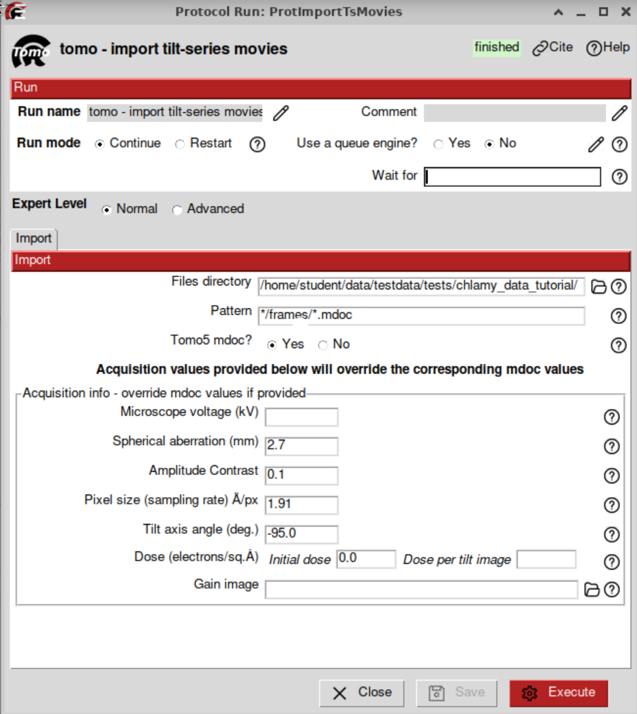

# Movie alignment and CTF estimation with Warp

**Reference**: [D. Tegunov et. al. 2021](https://doi.org/10.1038/s41592-020-01054-7)

**Plugin**: [scipion-em-warp](https://github.com/scipion-em/scipion-em-warp)

Once the tilt series movies were imported the acquired frames at each tilt angle will be aligned to obtain tilt series. The protocol `warp - tilt-series motion and ctf estimation` will find and correct the relative movement between the frames. This protocol also allows to estimate the CTF, it means the defocus of ech tilt image.

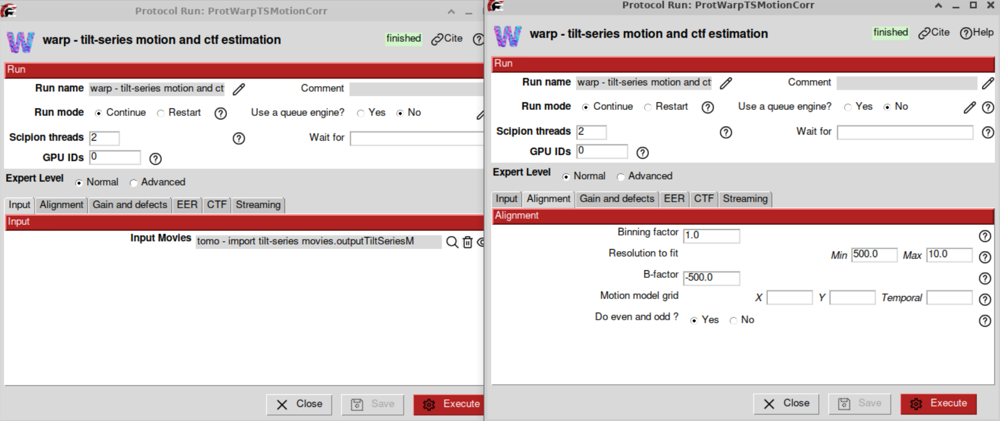
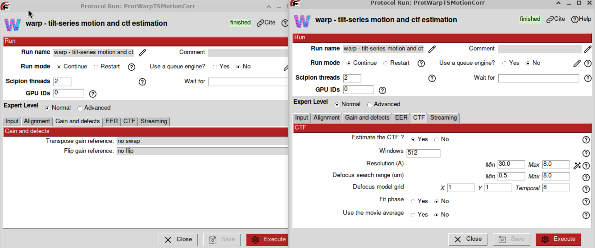

The most important parameters are:
- **Input movies:** The imported set of tilt series movies from the previous step.
- **Binning factor:** 1.0
- **Resolution to fit:** Min 500.0  Max 10.0 A
- **B-factor:** -500.0
- **Motion model grid:** Leave empty
- **Do even and odd:** Yes
- **Transpose gain reference:** No swap
- **Flip gain reference:** No flip
- **EER fraction:** 16 (No matter for this dataset)
- **EER group exposure:** Leave empty (No matter for this dataset)
- **Estimate CTF:** Yes. 
- **Windows:** 512
- **Resolution: (A)** Min 30, Max 8.0
- **Defocus search range (um):** Min 0.5, Max 8.0
- **Defocus model grid**: X=2, Y=2, Temporal = 8
- **Fit phase**: No
- **Use the movie average**: No

The output of the protocol will be a set of tilt series and a set of CTFs. It is possible to visualize these set with the `TomoViewer` and `CTFtomoViewer`.

# Excluding views and CTFs

## Excluding views

Some views can be excluded with the `TomoViewer`. The main reasons to exclude a tilt image are: Blck image, close to the carbon border, presence of contamination, or drift. To exclude a view just select the corresponding tilt image and press the `space`. Alternatively, it can be marked by clicking on the exclude box. The excluded views will be highlighted in red. Finally, it is neccesary to generate a new set of Tilt Series by clicking on the botton `Generate subsets`. 

For this dataset the low and high tilts will be removed. The first 7 negative tilts and the last 4 (positive tilts).

## Excluding CTFs

> There is no need to exclude CTFs for this dataset. The reader can do it if he wishes.

# X-ray eraser

**Reference**: [J.R. Kremer 1996](https://doi.org/10.1006/jsbi.1996.0013)

**Plugin**: [scipion-em-imod](https://github.com/scipion-em/scipion-em-imod)

The interaction of electrons with the sample can generate X-rays. They can be detected by the camera, and identified in the images as very bright pixels. Therefore, the X-ray peaks are an unwanted effect that should be corrected. The protocol `imod - Xray eraser` allows to remove these bright points. The input will be a tilt series (output of the movie alignment). This protocol also can be executed with default parameters.

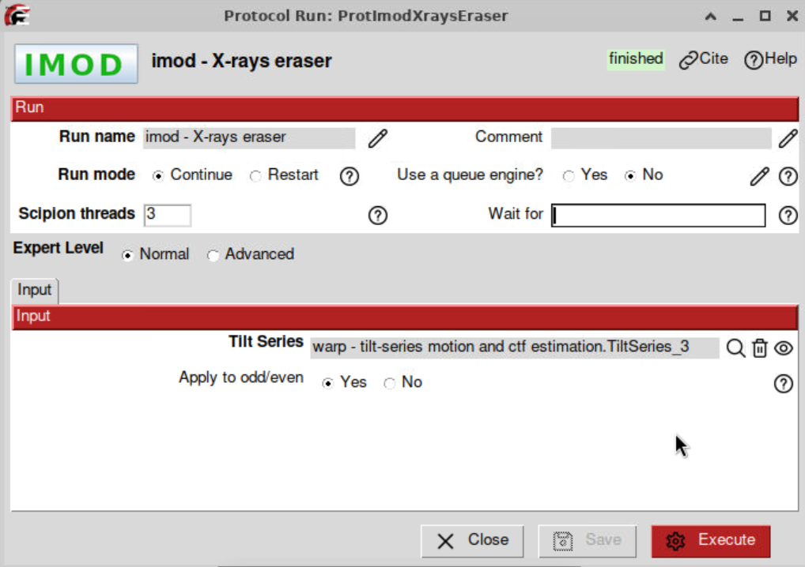

The ouput of this protocol will be a set of Tilt Series that looks almost identical to the input tilt series.

# Tilt series alignment

There are many methods to align tilt series in the ScipionTomo framework, as they are:

 - IMOD
 - Aretomo
 - EmanTomo

In this tutorial `aretomo - tilt series align and reconstruct` will be used. The user can play with imod - patch tracking to try with a different alignment.

## Aretomo - tilt series align and reconstruct
**Reference**: [S. Zheng 2022](https://doi.org/10.1016/j.yjsbx.2022.100068)

**Plugin**: [scipion-em-aretomo](https://github.com/scipion-em/scipion-em-aretomo)

To reconstruct the tomogram from the tilt series the protocol `tomo3aretomo - tilt series align and reconstruct`. This protocol performs the alignment and reconstruction at once. The result will be a set of aligned tilt series and the reconstructed tomogram. Also the CTF estimation is possible if the user select the CTF estimation option. It offers two different reconstruction algorithms: Weighted Back projection (WBP) and Simultaneous algebraic reconstruction technique (SART).

> **Tip**: WBP is faster than the SART method, but SART provides higher contrast. To visualize cellular enviroments SART is recommended, or to pick subtomogram with a template matching approach.

The used parameters will be

- **Input Tilt Series**: This set will be the imported tilt series
- **Skip alignment**: No
- **Reconstruct tomograms**: Yes
- **Reconstruct odd even**: Yes
- **Binning**: 4. The tomogram will be reconstructed at bin 4
- **Volume height for alignment**: 1000
- **Tomogram thickness**: 2048
- **Refine tilt angles?**: Measure and correct
- **Refine tilt axis angle?** Refine and use the refined value for the entire tilt series
- **Do dose weighting?**: Yes
- **Reconstruction method**: WBP
- **Dark tolerance**: 0.7

The input of the aretomo will be the imported tilt series. To reduce the computational burden, the WBP algorithm will be chosen, and the tomomgrams will be reconstructed at binning 4.

The output can be visualized by clicking on Analyze results or alternatively by choosing the visualization tool by right-clicking on the output in the Summary box.

# CTF correction

**Reference**: [J.R. Kremer 1996](https://doi.org/10.1006/jsbi.1996.0013)

**Plugin**: [scipion-em-imod](https://github.com/scipion-em/scipion-em-imod)

> Note: Scipion has a standard CTF model, when the CTF is estimated with any CTF estimator, the output is converted and stored in the Scipion standard. To correct the CTF, Scipion converts the standard into the corresponding package (in this case imod).

The CTF correction can be performed with the protocol `imod - correct CTF`. The input of this protocol are the tilt series with assigned alignment and a set of CTFs previously estimated. The tilt series will be the ones we assigned the alignment information. The used parameters for this protocol will be left as default parameters.

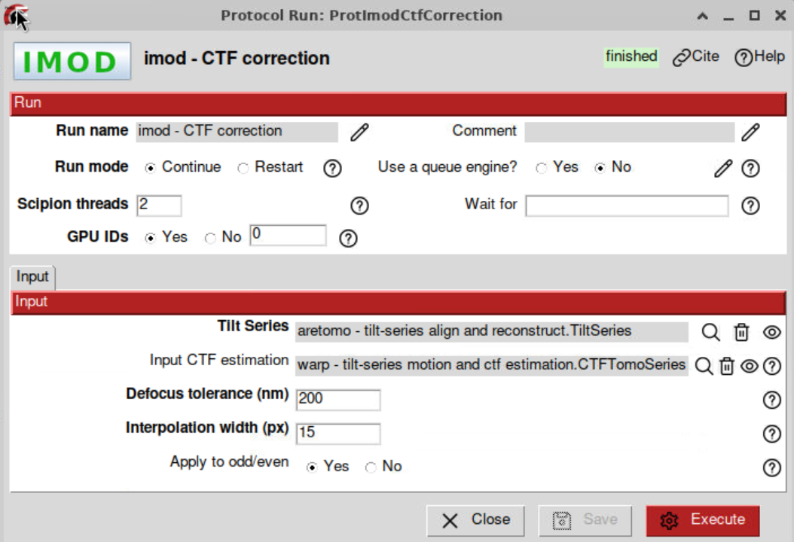

# Tilt series preprocess

**Reference**: [J.R. Kremer 1996](https://doi.org/10.1006/jsbi.1996.0013)

**Plugin**: [scipion-em-imod](https://github.com/scipion-em/scipion-em-imod)

The CTF-corrected tilt series will be the input data for a later tomogram reconstruction. Up to this step we have worked with the full-size tilt series (binning 1). IF the tomograms are reconstructed at bin 1, they will be very heavy. To safe disc and enhance the SNR of the tomogram the tilt series will be binned. The protocol `imod - preprocess tilt series` allows to perform different preprocessing operation on the tilt series, as binning or adjusting the gray values. 

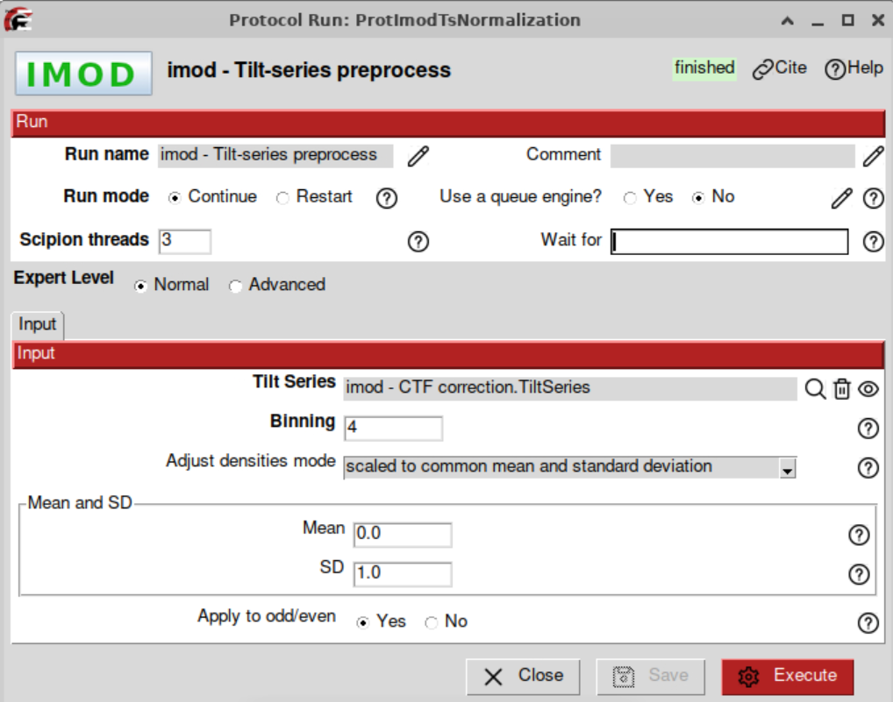

# Tomogram reconstruction

There are many methods to reconstruct tomograms in ScipionTomo framework, as they are:

 - Tomo3d
 - Imod
 - AreTomo
 - Emantomo

This tutorial uses IMOD.

## Tomogram reconstruction with IMOD

**Reference**: [J.R. Kremer 1996](https://doi.org/10.1006/jsbi.1996.0013)

**Plugin**: [scipion-em-imod](https://github.com/scipion-em/scipion-em-imod)

To reconstruct the tomogram from the tilt series the protocol `imod - reconstruct tomogram` will be used. IMOD provides two different reconstruction algorithm: Weighted Back Projection (WBP) and SIRT-like filtered tomograms.

> **Tip**: WBP is faster than the SIRT-like method, but SIRT provides higher contrast. To visualize cellular enviroments SIRT is recommended, or to pick subtomograms with a template matching approach.

The input of the reconstruction will be the binned tilt series. The `Tomogram Thickness` was set to 350 voxels.

The protocol can be executed with default parameters:

- **Tilt series**: The binned tilt series
- **Tomogram Thickness**: 350
- **Tomogram width (voxels)**: 0
- **Tomogram Shift**: In X 0.0   in Z 0.0
- **Offset (deg) of the**: Tilt angles 0.0  Tilt axis 0.0
- **Super-sampling factor**: 2
- **Iterations of a SIRT-like equivalent filter**: 10
- **Cutoff linear region**: 0.35
- **Radial fall-off**: 0.035

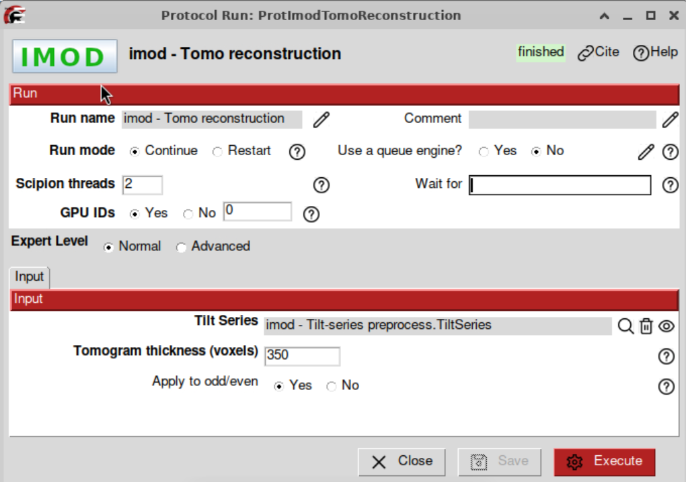

The output can be visualized by clicking on Analyze results or alternatively by choosing the visualization tool by right-clicking on the output in the Summary box.

# Picking

This dataset can be picked with any of the next software packages

* Sphire - cryolo
* Emantomo - template matching
* Gapstop  - template matching
* Deepfinder

For this tutorial, emantomo - template matching will be used

## Import a reference

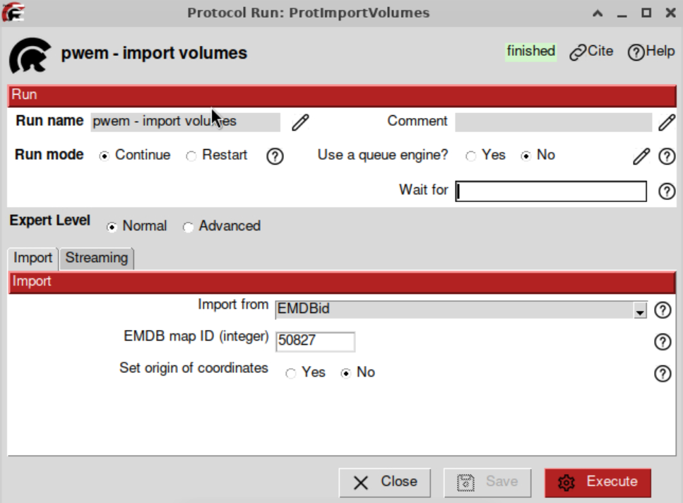

## Resize the reference

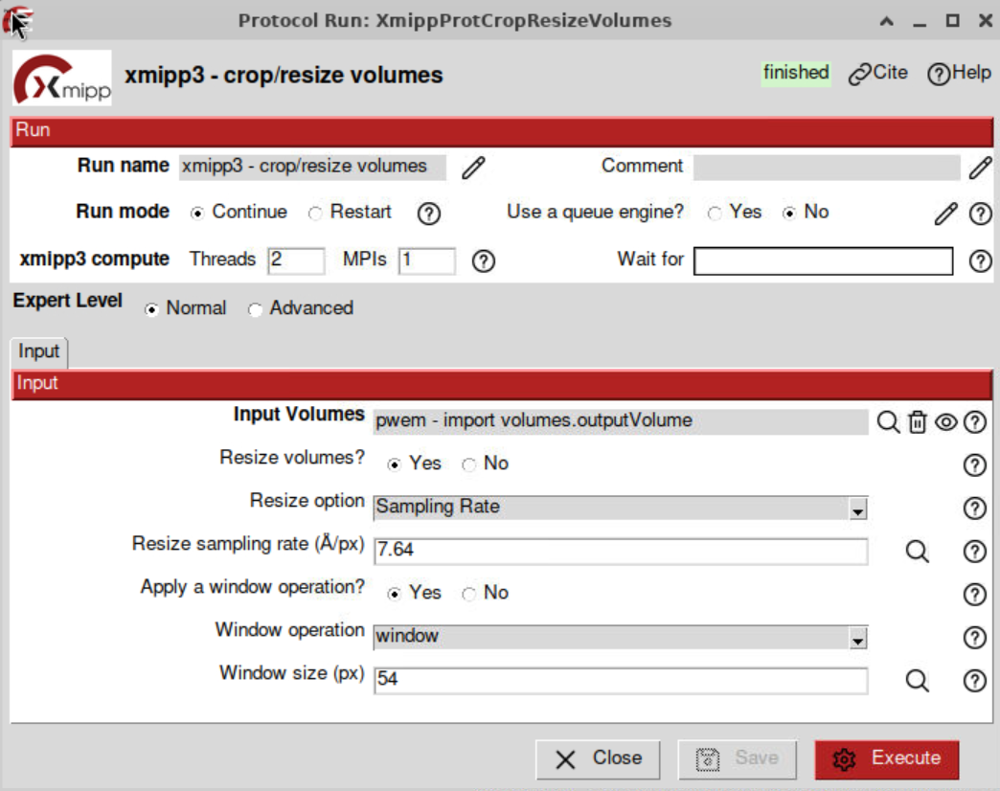

## Emantomo template matching

**Reference**: [M. Chen et.al 2019](https://doi.org/10.1038/s41592-019-0591-8)

**Plugin**: [scipion-em-emantomo](https://github.com/scipion-em/scipion-em-emantomo)

It is neccesary to identify the proteins in the tomograms. The protocol `emantomo - template matching` will be used. for these tomograms the next parameters will be used:

- **Input tomograms**: The reconstructed ones
- **Template**: The imported and resized volume
- **Maximum no. particles picked among the tomogams**: 800
- **Distance threshold**: -1
- **Template matching threshold (n sigma)**: 6.0
- **Symmetry of the reference**: c1
- **Remove particles on the edge**: No
- **Remove particles near gold fiducials**: No

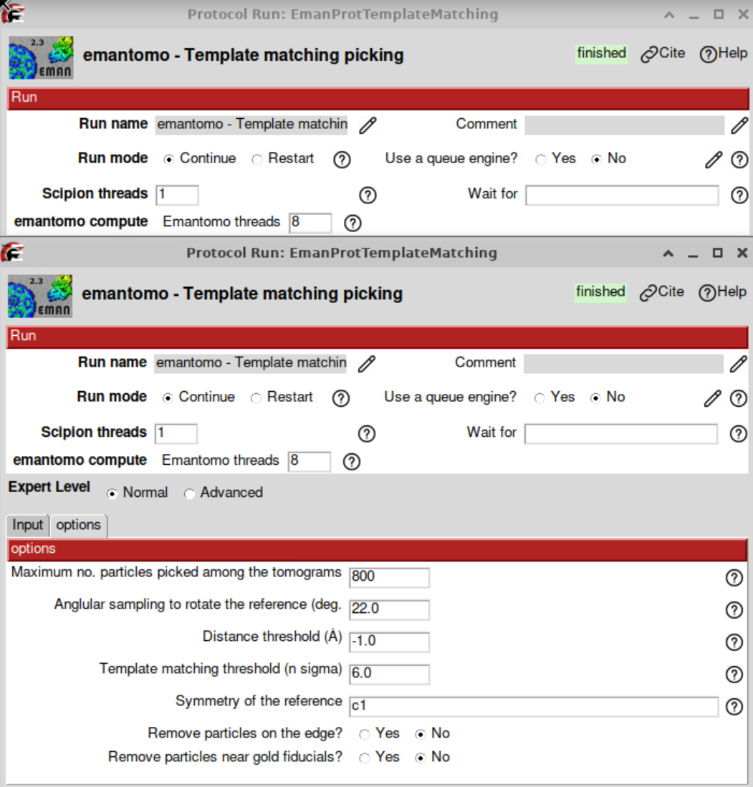

# Subtomogram Averaging with RelionTomo

**Reference**: [A. Burt 2024](https://doi.org/10.1002/2211-5463.13873)

**Plugin**: [scipion-em-reliontomo](https://github.com/scipion-em/scipion-em-reliontomo)

## Extract pseudo-subtomograms at bin 8

Pseudo-subtomograms are 2D cropped images or 3D-reconstructed subtomograms, premultiplied by the CTF. They do not represent physical objects. The premultiplication by the CTF, allows to avoid aliasing and speed up the computational times. The protocol `reliontomo - extract subtomos` can be used to extract the pseudo-subtomograms. This protocol allows to extract them as 2D or 3D. In this tutorial both kinds of psuedo subtomogram will be extracted. The 3D pseudo-subtomogram will be used for generating an initial volume, and the 2D pseudo-sutomograms will be used in the refinement step.

To extract the pseudo subtomograms the next input data will be required:

- **Tilt series**: They must contain the alignment information.
- **CTF estimation**: From the Warp estimation with the excluded views
- **Coordinates**: They are the picked coordinates.
- **Binning factor**: 8 This is the scaling factor in relation to the input tilt series
- **Box size (px)**: 64. This box size will be used to correct the CTF in the cropped particles from the tilt series
- **Croppped box size (px)**: 32. This will be the size of the pseudo-subtomograms and therefore of the reconstructed map.
- **Write output as 2D stacks**: No. 

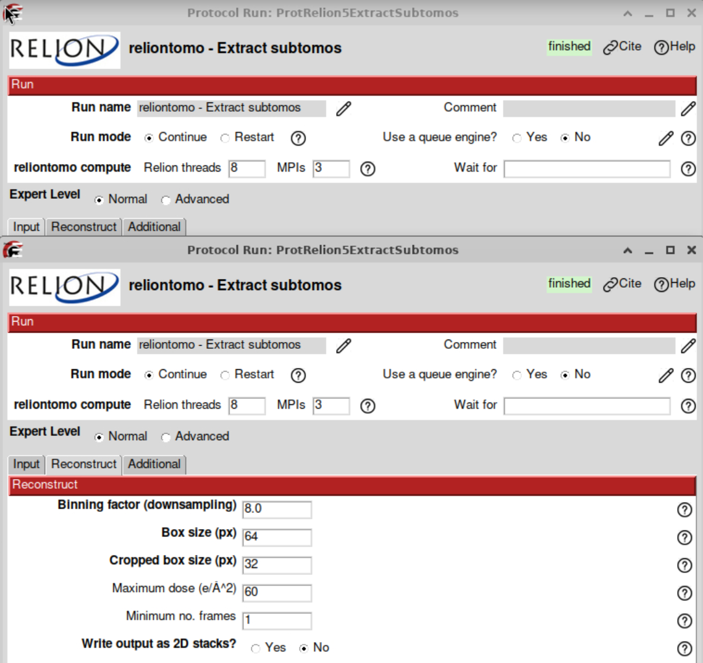

> **Tip**: The 3D pseudo-subtomograms work better for obtaining a 3D initial model than the 2D pseudo-subtomograms.

## Initial model

The initial model can be estimated with the protocol `reliontomo - 3D initial model`. The input will be the extracted 3D pseudo-subtomogram at bin 10 from the previous step. 

- **Number of VDAM mini-batches**: 40. This is the number of iterations to be carried out.
- **Regularization parameter**: 4.0 It goes from 0 to 4. Values close to 4 put more strenght on the data.
- **Circular Mask diameter**: 350 A. A good value is to set the protein diameter
- **Symmetry group**: C1. In this case the protein has no symmetry. For initial volumes a C1 symmetry is a good practice.
- **Prior width on tilt angle**: -1. It defines the prior on the tilt to be estimated. -1 means no priors
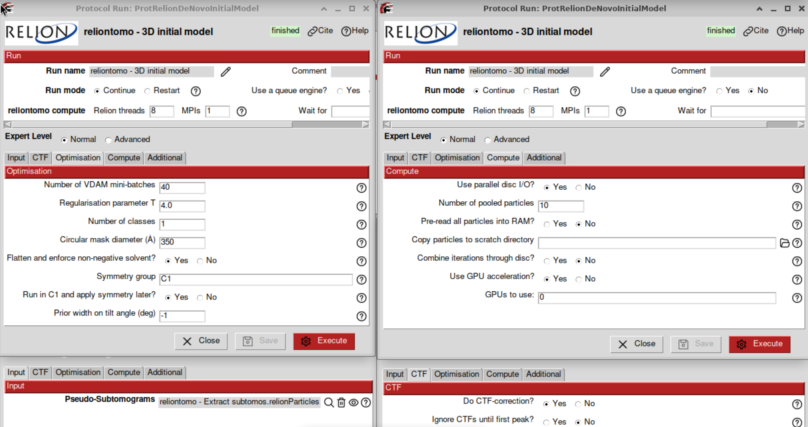

## 3D Auto-refine at bin 8

Using the initial model, it is possible to refine it to enhance the map quality pushing the resolution. Despite at binnin 10 the initial volume presents enought quality, we will enhance a litle bit more the map reaching Nyquist resolution, and then in a later step extract the pseudo-subtomogram at a smaler pixel size. To refine the model, the protocol `reliontomo - 3D auto-refine` can be used. The input will be the extracted **3D** pseudo-subtomogram at bin 8 and the estimated initial model. The refinement parameter will be. 

- **Pseudo-subtomograms**: The extracted 3D-pseudosubtomograms. Despite for refining the 2D-psedosubtomograms are recommended, at this so low resolution the 3D will be used.
- **Reference volume**: The obtained initial volume
- **Is initial 3D map on absolute greyscale?1**: Yes
- **Resize references if needed?**: Yes
- **Initial low-pass filter (A)**: 40A
- **Symmetry group**: C1
- **Do CTF-correction?**: Yes
- **Ignore CTF until first peak?**: No
- **Circular Mask diameter**: 350A.
- **Mask particles with zeros**: Yes
- **Use blush regularization**: No
- **Initial angular sampluing interval**: 7.5 deg
- **Initial offset range (px)**: 5 px
- **Initial offset step (px)**: 1 px
- **Local searches from auto-sampling**: 1.8 deg
- **Symmetry to be relaxed**: Leave empty
- **Use finer angulat sampling faster**: No
- **Prior width on tilt angle**: -1

The result of this protocol should be similar to the one shown in the Figure.
.

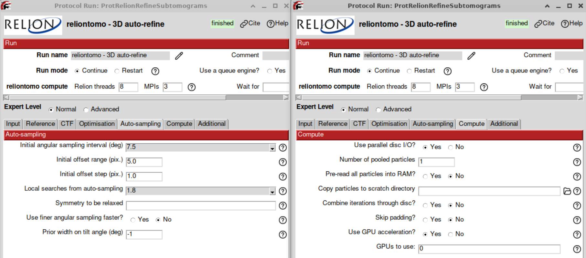

## Extract pseudo-subtomograms at bin 4

This steps shows how to reduce the binning keeping the alignment of already refined pseudo-subtomograms. The protocol `reliontomo - extract subtomos` allows this task. The parameters:

- **Coordinates**: They will be the refined pseudo-subtomograms from the 'reliontomo - 3d auto-refine`.
- **CTF**: The estimated with Warp with excluded views.
- **Tilt series**: The aligned ones with dose and excluded views.
- **Binning**: 4.0.
- **Box size (px)**: 128 px. This box size will be used to correct the CTF in the cropped particles from the tilt series
- **Croppped box size (px)**: 64 px. This will be the size of the pseudo-subtomograms and therefore of the reconstructed map.
- **Maximum dose**: 50 e/A^2.
- **Write output as 2D stacks**: No

## Reconstruct particle at bin 4

In this step the refined pseudo-subtomograms from the previous autorefine are used to reconstruct the protein, but keeping their angular assignment. This is only a reconstruction step. The protocol `reliontomo - reconstruct particle` 

- **Coordinates/Pseudo-subtomograms**: They will be the refined pseudo-subtomograms from the 'reliontomo - 3d auto-refine`.
- **Binning**: 4.0.
- **Box size (px)**: 128 px. This box size will be used to correct the CTF in the cropped particles from the tilt series
- **Croppped box size (px)**: 64 px. This will be the size of the pseudo-subtomograms and therefore of the reconstructed map.
- **Symmetry group**: C1.
- **Apply Wiener filter with SNR**: 0.0

The reconstructed protein can be visualized with Scipion (to see the slices) or with Chimera (to see the 3D map). As it can be observed in the figure the map quality enhanced in comparison to the reconstruction at bin 8. 

## Refine volume at bin 4

Now the obtained reconstruction will be refined with the aim of pushing the resolution of the reconstructed map.  The protocol `reliontomo - extract subtomos` will be used with the next parameters

- **Pseudo-subtomograms**: The 3D extracted ones at bin 4
- **Reference Volume**: The reconstructed volume at bin 4 from the previous step
- **Reference Mask**: Leave empty, we lack of resolution for it
- **Is initial 3D map on absolute greyscale?1**: Yes
- **Resize references if needed?**: Yes
- **Initial low-pass filter (A)**: 15A
- **Symmetry group**: C1
- **Do CTF-correction?**: Yes
- **Ignore CTF until first peak?**: No
- **Circular Mask diameter**: 35A.
- **Mask particles with zeros**: Yes
- **Use blush regularization**: No
- **Initial angular sampluing interval**: 7.5 deg
- **Initial offset range (px)**: 5 px
- **Initial offset step (px)**: 1 px
- **Local searches from auto-sampling**: 1.8 deg
- **Symmetry to be relaxed**: Leave empty
- **Use finer angulat sampling faster**: No
- **Prior width on tilt angle**: -1 Meaning no prior

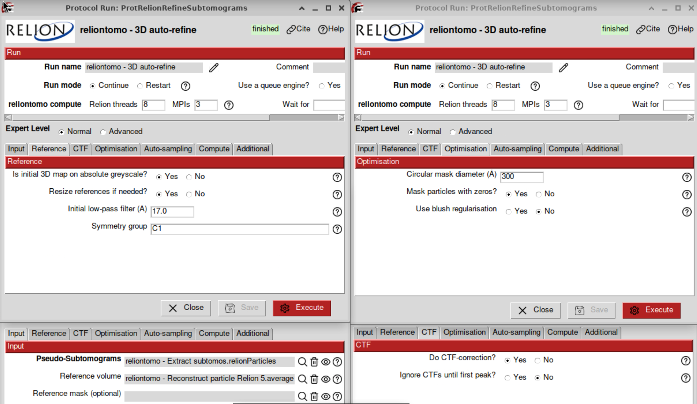
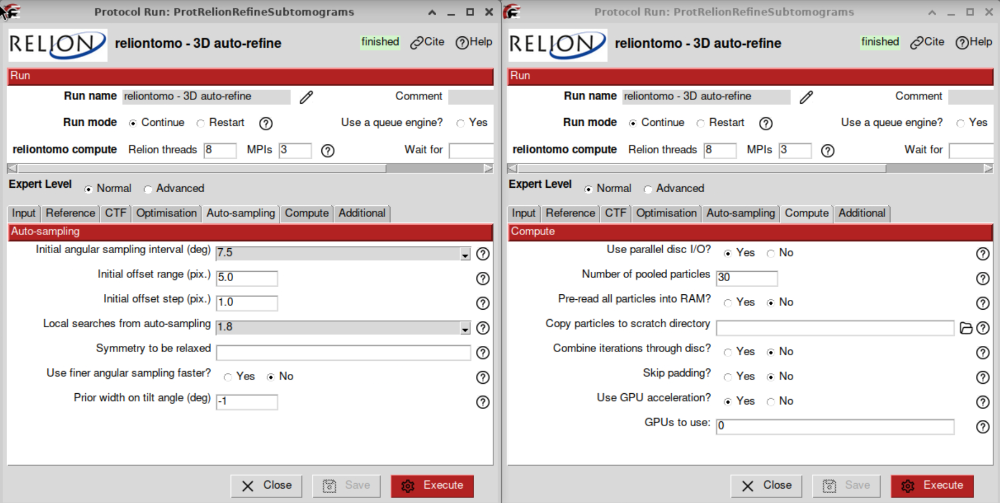

  
# Contact us

We want to hear from you! Any comment, question, or complaints regarding this tutorial, the use of Scipion can be sent to the next email: scipion@cnb.csic.es.

We also have a discord server where a cryoEM/ET community is active and in touch daily, please send us an email to scipion@cnb.csic.es to get an invitation. 

# References
- JM De la Rosa-Trevín, A Quintana, L Del Cano, et al. Scipion: A software framework toward integration, reproducibility and validation in 3D electron microscopy, Journal of Structural Biology, 195,1, 93-99 (2016).
- A. Burt, C.K. Cassidy, P. Ames, P. et al. Complete structure of the chemosensory array core signalling unit in an E. coli minicell strain. Nat Commun 11, 743 (2020).
- J.R. Kremer, D.N. Mastronarde, J.R McIntosh, Computer Visualization of Three-Dimensional Image Data Using IMOD, Journal of Structural Biology, 116, 1, 71-76 (1996)
- D.N. Mastronarde, S.R. Held, Automated tilt series alignment and tomographic reconstruction in IMOD, Journal of Structural Biology, 197, 2, 102-113 (2017)
- JI Agulleiro, JJ Fernandez. Fast tomographic reconstruction on multicore computers. Bioinformatics 27:582-583, (2011).
- JI Agulleiro, JJ Fernandez. Tomo3D 2.0--exploitation of advanced vector extensions (AVX) for 3D reconstruction. Journal of Structural Biology 189:147-152, (2015).
- A. Rohou, N. Grigorieff, CTFFIND4: Fast and accurate defocus estimation from electron micrographs, Journal of Structural Biology, 192, 2, (2015)
- M. Chen, J.M. Bell, X. Shi, X. et al. A complete data processing workflow for cryo-ET and subtomogram averaging. Nat Methods 16, 1161–1168 (2019) 
- Q. Xiong, M.K. Morphew, C.L. Schwartz, CTF Determination and Correction for Low Dose Tomographic Tilt Series, Journal of Structural Biology, 168(3) 378–387 (2009). 

