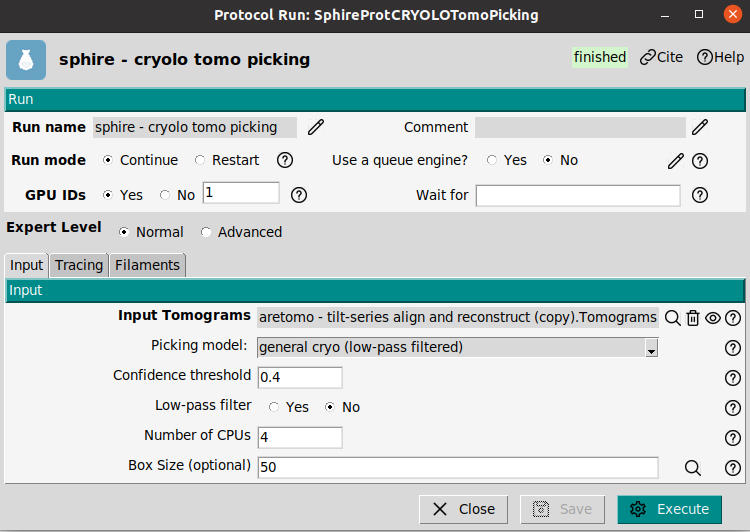
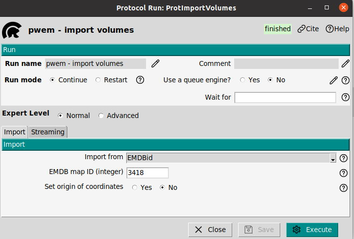
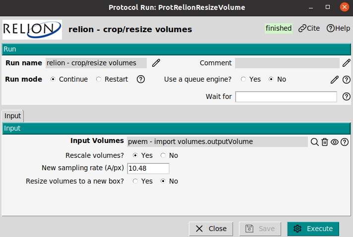
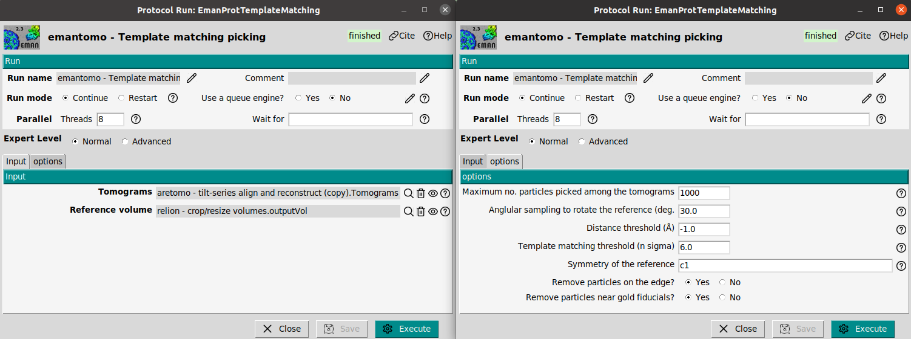

---
title: "HIV tutorial with ScipionTomo"
author: [Scipion Team]
date: "2024-10-13"
subject: "Markdown"
keywords: [Markdown, Example]
subtitle: "From movies to averages"
lang: "en"

titlepage: true
titlepage-text-color: "7137C8"
titlepage-rule-color: "7137C8"
titlepage-rule-height: 2
titlepage-logo: "logo.pdf"
logo-width: 30mm
toc: true
toc-own-page: true
...

# The dataset

The used data for this tutorial can be found the next link [https://scipion.cnb.csic.es/downloads/scipion/data/tests/nonOrientedPicking_tutorial/](https://scipion.cnb.csic.es/downloads/scipion/data/tests/nonOrientedPicking_tutorial/) or also can be downloaded using the next command line

> scipion3 testdata --download nonOrientedPicking_tutorial

The link contains a small subsets of 4 tilt series from the EMPIAR entry [EMPIAR-10064](https://www.ebi.ac.uk/empiar/EMPIAR-10064), see the reference [M. Khoshouei et.al 2017](https://doi.org/10.1016/j.jsb.2016.05.009). This entry considers presents different acquisitions, the used one for this tutorial is the CTEMmixed.

# Workflow of this tutorial

This tutorial aims to show non-oriented picking possibilities in ScipionTomo. The next workflow will be used

[workflowRec](figures/workflowRec.png)

# Import and tomogram reconstruction 

## Import tilt series

**Reference**: [J. Jimenez de la Morena et.at. 2022](https://doi.org/10.1016/j.jsb.2022.107872)

**Plugin**: [scipion-em-tomo](https://github.com/scipion-em/scipion-em-tomo)

The first step is to introduce the acquired data from the microscope into the Scipion framework. Tilt series can be imported with the protocol `tomo - import tilt series`. The original dataset only provides the .mrc files and an acquisition range, see [EMPIAR-10064](https://www.ebi.ac.uk/empiar/EMPIAR-10064). To simplify the import mdoc files were generated by our team, therefore they will be imported using the .mdoc files

> **Note**: It is mandatory that the mdoc files will be located in the same folder of the mrc files.

The mdoc files contain all acquisition information. The protocol will read all necesary information from the mdoc files such as: Sampling rate, dose per frame, tilt axis angle, among others. The form is flexible enough to correct possible errors in the mdoc file. If the protocol parameters: Microscope voltage, spherical aberration, amplitude contrast, magnification, pixel size, tilt axis angle or dose are empty, these parameters will be read from the mdoc. However, if any of these parameters is provided, the introduced value will be used.

In the figure of the form, the used parameter for the import are shown. The critical ones are:
- **Files directory:** Set the path of your movies. Note that the mdoc files must be in the same folder.
- **pattern:** In thus tutorial we import with mdoc. Set as `*.mdoc` to import all mdoc files.
- **Tomo5 mdoc:** Set as No. 
- **Microscope Voltage:** 300kV
- **Spherical Aberration:** 2.7 mm
- **Amplitude contrast:**  0.1
- **Pixel size:** 0.675  A/px. Byt setting this parameter the pixelsize from the mdoc will be overwritten.

## Tomogram reconstruction with AreTomo

**Reference**: [S. Zheng 2022](https://doi.org/10.1016/j.yjsbx.2022.100068)

**Plugin**: [scipion-em-aretomo](https://github.com/scipion-em/scipion-em-aretomo)

To reconstruct the tomogram from the tilt series the protocol `tomo3aretomo - tilt series align and reconstruct`. This protocol performs the alignment and reconstruction at once. The result will be a set of aligned tilt series and the reconstructed tomogram. Also the CTF estimation is possible if the user select the CTF estimation option. It offers two different reconstruction algorithms: Weighted Back projection (WBP) and Simultaneous algebraic reconstruction technique (SART).

> **Tip**: WBP is faster than the SART method, but SART provides higher contrast. To visualize cellular enviroments SART is recommended, or to pick subtomogram with a template matching approach.

The used parameters will be

- **Input Tilt Series**: This set will be the imported tilt series
- **Skip alignment**: No
- **Reconstruct tomograms**: Yes
- **Binning**: 4. The tomogram will be reconstructed at bin 4
- **Volume height for alignment**: 600
- **Tomogram thickness**: 1200
- **Refine tilt angles?**: Measure and correct
- **Refine tilt axis angle?** Refine and calculate
- **Do dose weighting?**: Yes
- **Reconstruction method**: WBP
- **Dark tolerance**: 0.7

The input of the aretomo will be the imported tilt series. To reduce the computational burden, the WBP algorithm will be chosen, and the tomomgrams will be reconstructed at binning 4.

The output can be visualized by clicking on Analyze results or alternatively by choosing the visualization tool by right-clicking on the output in the Summary box.

# Cryolo Picking

**Reference**: [S. Zheng 2022](https://doi.org/10.1016/j.yjsbx.2022.100068)

**Plugin**: [scipion-em-sphire](https://github.com/scipion-em/scipion-em-sphire

Subtomograms can be picked in the tomogram using the cryolo program of the sphire plugin. Cryolo uses a deep learning model to identify the subtomograms. It is a non-oriented picker, and therefore the picked coordinates will not present orientation. 

> **Tip**: cryolo was trained using tomogram with a pixel size of 10A/px. To obtain a good picking it is a good practice to downsample the tomogram with a target pixel size of 10A.

The used parameters were:

- **Tomograms**: The reconstructed ones 
- **Picking model**: general cryo (low pass filtered)
- **Confidence threshold**: 0.4
- **Low pass filter**: No
- **Number of CPU**: 4
- **Box size**: 50

# Template matching

**Reference**: [S. Zheng 2019](https://doi.org/10.1016/j.yjsbx.2022.100068)

**Plugin**: [scipion-em-emantomo](https://github.com/scipion-em/scipion-em-emantomo)

## Import a reference

## Resize the reference

## Emantomo template matching
The used parameters were:

- **Tomograms**: The reconstructed ones
- **Reference volume**: The imported one from emdb
- **Maximum number of coordinates**: 1000
- **Angular sampling**: 30º
- **Distance threshold**: -1. This means half of the boxsize
- **Template matching threshold**: 6
- **Symmetry of the reference**: c1
- **Remove particles on the edge**: Yes
- **Remove particles close to fiducials**: Yes

# Contact us

We want to hear from you! Any comment, question, or complaints regarding this tutorial, the use of Scipion or xmipp can be sent to these emails: scipion@cnb.csic.es, xmipp@cnb.csic.es. 

Also you can follow us on our social media

Twitter: https://twitter.com/instructi2pc

Tutorials about Scipion use, and cryoEM seminars can be found on your YouTube channel

Youtube: https://www.youtube.com/user/BiocompWebs

We also have a slack channel where our most active members keep in touch daily. You can request access on scipion@cnb.csic.es
