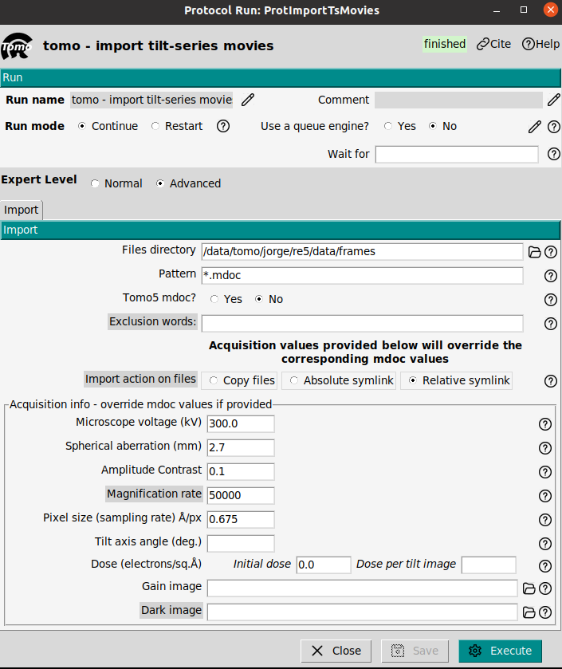

---
title: "HIV tutorial with ScipionTomo"
author: [Scipion Team]
date: "2024-10-13"
subject: "Markdown"
keywords: [Markdown, Example]
subtitle: "From movies to averages"
lang: "en"

titlepage: true
titlepage-text-color: "7137C8"
titlepage-rule-color: "7137C8"
titlepage-rule-height: 2
titlepage-logo: "logo.pdf"
logo-width: 30mm
toc: true
toc-own-page: true
...

# The dataset

The used data for this tutorial can be found the next link:

[http://scipion.cnb.csic.es/downloads/scipion/data/tutorials/tomography/](http://scipion.cnb.csic.es/downloads/scipion/data/tutorials/tomography/)

The link contains a small subsets of 4 tilt series from the EMPIAR entry [EMPIAR-10064](https://www.ebi.ac.uk/empiar/EMPIAR-10064), see the reference [M. Khoshouei et.al 2017](https://doi.org/10.1016/j.jsb.2016.05.009). This extrey consider different kinds of acquisitions, the used one for this tutorial is the CTEMmixed one.

# Workflow of this tutorial

This tutorial aims to show non-oriented picking possibilities in ScipionTomo. 

# Import and tomogram reconstruction 

## Import tilt series

**Reference**: [J. Jimenez de la Morena et.at. 2022](https://doi.org/10.1016/j.jsb.2022.107872)

**Plugin**: [scipion-em-tomo](https://github.com/scipion-em/scipion-em-tomo)

The first step is to introduce the acquired data from the microscope into the Scipion framework. The tilt series can be imported with the protocol `tomo - import tilt series`. The original dataset only provides the .mrc files and an acquisition range, see [EMPIAR-10064](https://www.ebi.ac.uk/empiar/EMPIAR-10064). To simplify the import mdoc files were generated by our team.

> **Note**: It is mandatory that the mdoc files will be located in the same folder of the mrc files.

The mdoc files contain all acquisition information. The protocol will read all necesary information from the mdoc files such as: Sampling rate, dose per frame, tilt axis angle, among others. The form is flexible enough to correct possible errors in the mdoc file. If the protocol parameters: Microscope voltage, spherical aberration, amplitude contrast, magnification, pixel size, tilt axis angle or dose are empty, these parameters will be read from the mdoc. However, if any of these parameters is provided, the introduced value will be used.

In the figure of the form, the used parameter for the import are shown. The critical ones are:
- **Files directory:** Set the path of your movies. Note that the mdoc files must be in the same folder.
- **pattern:** In thus tutorial we import with mdoc. Set as `*.mdoc` to import all mdoc files.
- **Tomo5 mdoc:** Set as No. 
- **Microscope Voltage:** 300kV
- **Spherical Aberration:** 2.7 mm
- **Amplitude contrast:**  0.1
- **Pixel size:** 0.675  A/px. Byt setting this parameter the pixelsize from the mdoc will be overwritten.

## Tomogram reconstruction with AreTomo

**Reference**: [S. Zheng 2022](https://doi.org/10.1016/j.yjsbx.2022.100068)

**Plugin**: [scipion-em-aretomo](https://github.com/scipion-em/scipion-em-aretomo)

To reconstruct the tomogram from the tilt series the protocol `tomo3aretomo - tilt series align and reconstruct`. This protocol performs the alignment and reconstruction at once. The result will be a set of aligned tilt series and the reconstructed tomogram. Also the CTF estimation is possible if the user select the CTF estimation option. It offers two different reconstruction algorithms: Weighted Back projection (WBP) and Simultaneous algebraic reconstruction technique (SART).

> **Tip**: WBP is faster than the SART method, but SART provides higher contrast. To visualize cellular enviroments SART is recommended, or to pick subtomogram with a template matching approach.

The used parameters will be

- 
- 
- 
- 
- 
- 
- 
- 

The input of the aretomo will be the imported tilt series. To reduce the computational burden, the WBP algorithm will be chosen, and the tomomgrams will be reconstructed at binning 4.

The output can be visualized by clicking on Analyze results or alternatively by choosing the visualization tool by right-clicking on the output in the Summary box.

# Cryolo Picking

# Template matching

  

# Directional picking with dynamo

**Reference**: [J.I. Agulleiro 2011](https://doi.org/10.1093/bioinformatics/btq692)

**Plugin**: [scipion-em-dynamo](https://github.com/scipion-em/scipion-em-dynamo)

This picker is quite flexible and it is designed to pick broad variety of geometries: vesicles, spheres, or filaments among other. The input of this protocol only requires the set of tomograms to be picked. It is composed by two steps:
- **dynamo - vectorial picking**: This step aims to pick a set of points that define a mesh. The mesh would represent a first approach to the geometry to be picked.
- **dynamo - model workflow**: The previous meshed will be fitted to the selected geometrical model. Then, random points will be selected on the mesh as coordinates of the particles.
  
This section shows how to pick with dynamo, however, to avoid the manual task of picking a set of coordinates is also provided in a file. These coordinates can be imported in Scipion.

## Dynamo vectorial picking

In the reconstructed tomograms it is possible to observed different HIV virus. In our case we are interested in the reconstruction of structure of the immature capsid lattice. It is neccesary to identify the capsid in the tomograms. To do that the protocol `dynamo - vectorial picking` can be used. The parameter boxsize only has visualization purpose on the tomogram, it does not affect to the picked coordinates.

When the protocol is executed, a list of tomograms to be picked will appear in a new window. By double clicking on a tomogram the dynamo picking interface will be opened. The virus will be manually picked using an ellipsoidal vesicle model, as it is shown in the figure. Then, it will be neccesary to select on the capsid contour placing the mouse pointer on the capsid and using the key `c` to fix a marker. Once the capsid of a virus has been picked, a new model (ellipsoidal vesicle) will be created and the process repeated until end with the picking of all viruses presented the tomogram. Then, the dynamo interface can be closed and the list window with the list of tomogram will be updated with the number of picked coordinates in the already picked tomogram.

> **Note**: Dynamo picker is an oriented picker. This means that the picked coordinates have an orientation (transformation matrix). The orientation will be the normal direction to the picked surface.

## Dynamo model workflow

The protocol `dynamo - model workflows` uses the picked set of meshed as result of the protocol `dynamo - vectorial picking` and provides a 

## Extract subtomograms

Pseudo-subtomograms are 2D cropped images or 3D-reconstructed subtomograms, premultiplied by the CTF. They do not represent physical objects. The premultiplication by the CTF, allows to avoid aliasing and speed up the computational times. The protocol `reliontomo - extract subtomos` can be used to extract the pseudo-subtomograms. This protocol allows to extract them as 2D or 3D. In this tutorial both kinds of psuedo subtomogram will be extracted. The 3D pseudo-subtomogram will be used for generating an initial volume, and the 2D pseudo-sutomograms will be used in the refinement step.

To extract the pseudo subtomograms the next input data will be required:

- **Tilt series**: They must contain the alignment information.
- **CTF estimation**: From the CTFfind estimation with the excluded views
- **Coordinates**: They are the picked coordinates. The imported coordinates will be used
- **Binning factor**: This is the scaling factor in relation to the input tilt series
- **Box size (px)**: This box size will be used to correct the CTF in the cropped particles from the tilt series
- **Croppped box size (px)**: This will be the size of the pseudo-subtomograms and therefore of the reconstructed map.
- **Write output as 2D stacks**: Set Yes for 2D pseudo-subtomograms and No for 3D pseudo-subtomograms.

> **Tip**: The 3D pseudo-subtomograms work better for obtaining a 3D initial model than the 2D pseudo-subtomograms.

## Initial model

The initial model can be estimated with the protocol `reliontomo - 3D initial model`. The input will be the extracted 3D pseudo-subtomogram at bin 6 from the previous step. 

- **Number of VDAM mini-batches**: 70. This is the number of iterations to be carried out.
- **Regularization parameter**: 4. It goes from 0 to 4. Values close to 4 put more strenght on the data.
- **Circular Mask diameter**: 500 A. A good value is to set the protein diameter
- **Symmetry group**: C6. In this case the protein has C6 symmetry. For initial volumes a C1 symmetry is recommended.
- **Prior width on tilt angle**: 10. degrees. It defines the prior on the tilt to be estimated

The result of this protocol should be similar to the one shown in the Figure. To visualize it, the average map can be opened with Scipion or Chimera.

# Contact us

We want to hear from you! Any comment, question, or complaints regarding this tutorial, the use of Scipion or xmipp can be sent to these emails: scipion@cnb.csic.es, xmipp@cnb.csic.es. 

Also you can follow us on our social media

Twitter: https://twitter.com/instructi2pc

Tutorials about Scipion use, and cryoEM seminars can be found on your YouTube channel

Youtube: https://www.youtube.com/user/BiocompWebs

We also have a slack channel where our most active members keep in touch daily. You can request access on scipion@cnb.csic.es

# References
- JM De la Rosa-Trevín, A Quintana, L Del Cano, et al. Scipion: A software framework toward integration, reproducibility and validation in 3D electron microscopy, Journal of Structural Biology, 195,1, 93-99 (2016).
- A. Burt, C.K. Cassidy, P. Ames, P. et al. Complete structure of the chemosensory array core signalling unit in an E. coli minicell strain. Nat Commun 11, 743 (2020).
- B. Turoňová B, M. Sikora, C. Schürmann, et. al. In situ structural analysis of SARS-CoV-2 spike reveals flexibility mediated by three hinges, Science 370 203-208 (2020)
- J.R. Kremer, D.N. Mastronarde, J.R McIntosh, Computer Visualization of Three-Dimensional Image Data Using IMOD, Journal of Structural Biology, 116, 1, 71-76 (1996)
- D.N. Mastronarde, S.R. Held, Automated tilt series alignment and tomographic reconstruction in IMOD, Journal of Structural Biology, 197, 2, 102-113 (2017)
- JI Agulleiro, JJ Fernandez. Fast tomographic reconstruction on multicore computers. Bioinformatics 27:582-583, (2011).
- JI Agulleiro, JJ Fernandez. Tomo3D 2.0--exploitation of advanced vector extensions (AVX) for 3D reconstruction. Journal of Structural Biology 189:147-152, (2015).
- A. Rohou, N. Grigorieff, CTFFIND4: Fast and accurate defocus estimation from electron micrographs, Journal of Structural Biology, 192, 2, (2015)
- M. Chen, J.M. Bell, X. Shi, X. et al. A complete data processing workflow for cryo-ET and subtomogram averaging. Nat Methods 16, 1161–1168 (2019) 
- Q. Xiong, M.K. Morphew, C.L. Schwartz, CTF Determination and Correction for Low Dose Tomographic Tilt Series, Journal of Structural Biology, 168(3) 378–387 (2009). 
- B. Turoňová, F.K.M. Schur, W. Wan, and  J.A.G. Briggs, Efficient 3D-CTF correction for cryo-electron tomography using NovaCTF improves subtomogram averaging resolution to 3.4 Å, Journal of Structural Biology, 199, 3, 187-195, 2017

